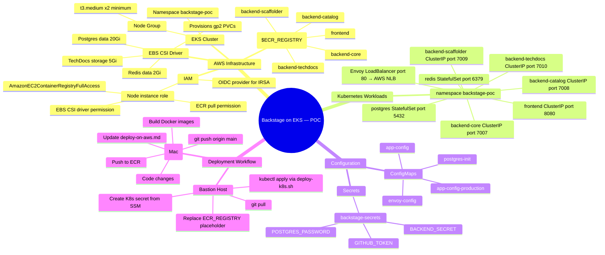

# Backstage Microservices — AWS EKS POC Deployment

> **Purpose:** Track every code change, AWS action, and decision made while deploying this POC.
> Every time something changes — in code or on AWS — a new entry goes in the [Change Log](#change-log).
>
> **Goal:** Deploy Backstage microservices on EKS securely, understand the end-to-end flow,
> and learn what each layer does. Single PostgreSQL and single Redis as containers inside the cluster.

---

## Values You Must Provide Before Deploying

There are three groups of values. Each group is set in a different place at a different time.

---

### Group 1 — Before building the frontend image (on your Mac)

These are set as shell environment variables before running `build-push-ecr.sh`. They get baked into the frontend JavaScript bundle at Docker build time. You cannot change them later without rebuilding the image.

| Variable | Where it is used | What to set it to |
|---|---|---|
| `APP_BASE_URL` | `packages/app/app-config.yaml` → `app.baseUrl` | Public URL of the app e.g. `https://backstage-poc-aws.opstree.dev` |
| `BACKEND_BASE_URL` | `packages/app/app-config.yaml` → `backend.baseUrl` | Same public URL — the browser uses this to call backend APIs |

**How to provide:**
```bash
# Set on your Mac before building the frontend image
export APP_BASE_URL=https://backstage-poc-aws.opstree.dev
export BACKEND_BASE_URL=https://backstage-poc-aws.opstree.dev

# Then build — the script reads these and passes them as Docker build args
./scripts/build-push-ecr.sh --service frontend
```

**What happens inside the script:**
`build-push-ecr.sh` passes them to Docker as `--build-arg APP_BASE_URL=... --build-arg BACKEND_BASE_URL=...`. The Dockerfile picks them up and the Backstage CLI substitutes them into the JavaScript bundle during `yarn workspace app build`.

---

### Group 2 — Already set in K8s manifest files (no action needed)

These values are hardcoded directly in the backend Deployment YAML files under the `env:` block. They are applied automatically when you run `kubectl apply`. You only need to change them if the domain name changes.

| Variable | File | Current value |
|---|---|---|
| `APP_BASE_URL` | `k8s/workloads/backend-*.yaml` (all 4) | `https://backstage-poc-aws.opstree.dev` |
| `BACKEND_BASE_URL` | `k8s/workloads/backend-*.yaml` (all 4) | `https://backstage-poc-aws.opstree.dev` |
| `CORS_ORIGIN` | `k8s/workloads/backend-*.yaml` (all 4) | `https://backstage-poc-aws.opstree.dev` |
| `BACKEND_LISTEN_PORT` | `k8s/workloads/backend-*.yaml` (each different) | 7007 / 7008 / 7009 / 7010 |
| `POSTGRES_HOST` | `k8s/workloads/backend-*.yaml` (all 4) | `postgres` (internal K8s DNS) |
| `POSTGRES_DB` | `k8s/workloads/backend-*.yaml` (each different) | `backstage_core` / `backstage_catalog` / etc. |

These values flow into the ConfigMap (`k8s/configmaps/app-config.yaml`) which uses `${ENV_VAR}` placeholders. At pod startup, the Node.js process substitutes them from the environment.

---

### Group 3 — Set on the bastion before `kubectl apply` (one-time setup)

These are secrets and deployment-specific values that cannot be committed to git.

| # | What | Where to provide | How to get the value |
|---|---|---|---|
| 1 | `ECR_REGISTRY` | Replace `<ECR_REGISTRY>` in `k8s/workloads/*.yaml` (all 5 files) | `aws sts get-caller-identity --query Account --output text` → `<account>.dkr.ecr.ap-south-1.amazonaws.com` |
| 2 | `BACKEND_SECRET` | K8s secret `backstage-secrets` → key `BACKEND_SECRET` | Random string: `openssl rand -base64 24` — store in SSM |
| 3 | `GITHUB_TOKEN` | K8s secret `backstage-secrets` → key `GITHUB_TOKEN` | GitHub PAT with `repo`, `read:org`, `read:user` scopes |
| 4 | `POSTGRES_PASSWORD` | K8s secret `backstage-secrets` → key `POSTGRES_PASSWORD` | Any strong password: `openssl rand -base64 16` — store in SSM |
| 5 | TLS certificate | K8s secret `backstage-poc-tls` in `backstage-poc` namespace | Copy from `backstage-tls` secret in `backstage` namespace |

**How to provide (run on bastion):**

```bash
# ── 1. Replace <ECR_REGISTRY> in all 5 workload YAML files ───────────────────
export AWS_ACCOUNT=$(aws sts get-caller-identity --query Account --output text)
export AWS_REGION=ap-south-1
export ECR_REGISTRY=$AWS_ACCOUNT.dkr.ecr.$AWS_REGION.amazonaws.com

for f in frontend backend-core backend-catalog backend-scaffolder backend-techdocs; do
  python3 -c "
content = open('k8s/workloads/$f.yaml').read()
open('k8s/workloads/$f.yaml','w').write(content.replace('<ECR_REGISTRY>', '$ECR_REGISTRY'))
"
done

# ── 2-4. Create the K8s secret from SSM (values never touch disk) ─────────────
kubectl create secret generic backstage-secrets \
  --namespace backstage-poc \
  --from-literal=BACKEND_SECRET="$(aws ssm get-parameter \
    --name /backstage/poc/BACKEND_SECRET --with-decryption \
    --query Parameter.Value --output text)" \
  --from-literal=GITHUB_TOKEN="$(aws ssm get-parameter \
    --name /backstage/poc/GITHUB_TOKEN --with-decryption \
    --query Parameter.Value --output text)" \
  --from-literal=POSTGRES_PASSWORD="$(aws ssm get-parameter \
    --name /backstage/poc/POSTGRES_PASSWORD --with-decryption \
    --query Parameter.Value --output text)"

# ── 5. Copy TLS certificate from backstage namespace to backstage-poc ──────────
# K8s secrets cannot be shared across namespaces — must be copied manually once
kubectl get secret backstage-tls -n backstage -o json \
  | jq 'del(.metadata.namespace,.metadata.resourceVersion,.metadata.uid,.metadata.creationTimestamp,.metadata.annotations,.metadata.labels)' \
  | jq '.metadata.name = "backstage-poc-tls"' \
  | kubectl apply -n backstage-poc -f -
```

---

### Summary — where each value lives

```
Mac (build time)
├── export APP_BASE_URL=https://...        ← shell env var, read by build-push-ecr.sh
└── export BACKEND_BASE_URL=https://...   ← shell env var, read by build-push-ecr.sh
        │
        ▼ passed as --build-arg to Docker
        ▼ Backstage CLI bakes into JS bundle
        frontend Docker image (ECR)

Bastion / K8s (deploy time)
├── k8s/workloads/*.yaml                  ← APP_BASE_URL, BACKEND_BASE_URL, CORS_ORIGIN hardcoded here
├── k8s/configmaps/app-config.yaml        ← uses ${ENV_VAR} placeholders, filled at pod startup
├── K8s Secret "backstage-secrets"        ← BACKEND_SECRET, GITHUB_TOKEN, POSTGRES_PASSWORD
└── K8s Secret "backstage-poc-tls"        ← TLS certificate for HTTPS
```

---

## Mind Map — Full Picture



---

## Architecture Diagram

```
           Internet / Your Browser
                    │
               port 80 (HTTP)
                    │
            ┌───────▼──────────────────────────────────────┐
            │              AWS EKS Cluster                  │
            │          Namespace: backstage-poc             │
            │                                              │
            │  ┌─────────────────────────┐                 │
            │  │  Envoy — LoadBalancer   │◄── AWS NLB      │
            │  │  (envoy-config ConfigMap│                 │
            │  └──┬──────┬──────┬───┬───┘                 │
            │     │      │      │   │                      │
            │  /api/  /api/  /api/ /*                      │
            │  cata  scaf   core                           │
            │  log   folder /api/                          │
            │  search techdocs                             │
            │  k8s                                         │
            │     │      │      │   │                      │
            │  ┌──▼─┐ ┌──▼──┐ ┌▼─┐ ┌▼──────────┐         │
            │  │cat │ │scaf │ │cor│ │ frontend  │         │
            │  │log │ │fold │ │e  │ │ nginx:8080│         │
            │  │7008│ │7009 │ │700│ └───────────┘         │
            │  └──┬─┘ └──┬──┘ └┬─┘                        │
            │  ┌──▼──────▼─────▼──────────────────────┐   │
            │  │        postgres:5432  redis:6379       │   │
            │  │        StatefulSet    StatefulSet      │   │
            │  └──────────────────────────────────────┘   │
            │                                              │
            │  ┌─────────────────────────────────────┐    │
            │  │     EBS Volumes (gp2 PVCs)           │    │
            │  │  postgres-data 20Gi                  │    │
            │  │  redis-data 2Gi                      │    │
            │  │  techdocs-storage 5Gi                │    │
            │  └─────────────────────────────────────┘    │
            └──────────────────────────────────────────────┘
```

---

## Directory Layout

```
k8s/
├── namespace.yaml                      ← creates namespace backstage-poc
├── configmaps/
│   ├── app-config.yaml                 ← base Backstage config (ConfigMap)
│   ├── app-config-production.yaml      ← production overrides (ConfigMap)
│   ├── envoy.yaml                      ← Envoy proxy routing rules (ConfigMap)
│   └── postgres-init.yaml              ← DB init script (ConfigMap)
├── secrets/
│   ├── backstage-secrets.template.yaml ← COMMIT: placeholder values
│   └── .gitignore                      ← ignores backstage-secrets.yaml
├── storage/
│   └── pvcs.yaml                       ← postgres, redis, techdocs PVCs
└── workloads/
    ├── postgres.yaml                   ← StatefulSet + headless Service
    ├── redis.yaml                      ← StatefulSet + headless Service
    ├── frontend.yaml                   ← Deployment + ClusterIP Service
    ├── backend-core.yaml               ← Deployment + ClusterIP Service
    ├── backend-catalog.yaml            ← Deployment + ClusterIP Service
    ├── backend-scaffolder.yaml         ← Deployment + ClusterIP Service
    ├── backend-techdocs.yaml           ← Deployment + ClusterIP Service
    └── envoy.yaml                      ← Deployment + LoadBalancer Service (NLB)

scripts/
├── build-push-ecr.sh                   ← build all images + push to ECR (run on Mac)
└── deploy-k8s.sh                       ← deploy all K8s manifests in order (run on bastion)
```

---

## App Config — Which File, When, and From Where

Each component owns a dedicated `app-config.yaml`. There is no single shared config — each package reads its own file at the appropriate time.

### Summary table

| Component | Config file | Read at | Mechanism |
|---|---|---|---|
| **frontend** | `packages/app/app-config.yaml` | **Docker build time** | Backstage CLI compiles values into the JS bundle during `yarn workspace app build` |
| **backend-core** | `k8s/configmaps/app-config.yaml` | **Container startup** | ConfigMap mounted at `/app/app-config.yaml`; Node.js reads it when the process starts |
| **backend-catalog** | `k8s/configmaps/app-config.yaml` | **Container startup** | Same — ConfigMap mount overwrites the file baked into the image |
| **backend-scaffolder** | `k8s/configmaps/app-config.yaml` | **Container startup** | Same |
| **backend-techdocs** | `k8s/configmaps/app-config.yaml` | **Container startup** | Same |

> **Local development (docker-compose):** All components fall back to the root `app-config.yaml` (localhost URLs, SQLite). That file is not used in EKS.

---

### Frontend — build time

```
packages/app/app-config.yaml
        │
        │  COPY packages/app ./packages/app
        │  cp packages/app/app-config.yaml app-config.yaml   ← Dockerfile
        ▼
  yarn workspace app build
        │
        │  Backstage CLI reads process.env and substitutes
        │  ${APP_BASE_URL} and ${BACKEND_BASE_URL}
        ▼
  packages/app/dist/*.js   ← values are frozen inside compiled JS
        │
        ▼
  nginx Docker image   ← only serves these static files; no config file inside
```

**Where the values come from:**
`packages/app/Dockerfile` declares `ARG APP_BASE_URL` and `ARG BACKEND_BASE_URL`.
`scripts/build-push-ecr.sh` reads those from host environment variables and passes them as `--build-arg`.

```bash
# Set before building the frontend image
export APP_BASE_URL=https://backstage-poc-aws.opstree.dev
export BACKEND_BASE_URL=https://backstage-poc-aws.opstree.dev
./scripts/build-push-ecr.sh --service frontend
```

**Why the nginx container has no config file at runtime:**
nginx just serves pre-built HTML/JS files. There is no Node.js process inside the container to read a config at startup. The values must exist at build time, not runtime.

---

### Backends — runtime

```
k8s/configmaps/app-config.yaml  (committed to git)
        │
        │  kubectl apply -f k8s/configmaps/app-config.yaml
        ▼
  ConfigMap "app-config" in namespace backstage-poc
        │
        │  volumeMounts:
        │    mountPath: /app/app-config.yaml   ← overwrites the file baked into the image
        ▼
  Node.js process starts → reads /app/app-config.yaml
        │
        │  Backstage reads process.env and substitutes ${ENV_VAR} tokens
        │  (e.g. ${BACKEND_BASE_URL}, ${POSTGRES_PASSWORD})
        ▼
  Config is live — env vars injected from each Deployment's env: block
```

**Where the values come from:**
Each backend Deployment (`k8s/workloads/backend-*.yaml`) declares an `env:` block with the concrete values. Backstage substitutes `${TOKEN}` references at startup from `process.env`.

```yaml
# k8s/workloads/backend-core.yaml
env:
- name: BACKEND_BASE_URL
  value: "https://backstage-poc-aws.opstree.dev"
- name: POSTGRES_PASSWORD
  valueFrom:
    secretKeyRef:
      name: backstage-secrets
      key: POSTGRES_PASSWORD
```

**How to confirm which config the backend is using (on bastion):**
```bash
# Print the mounted config file inside the running pod
kubectl exec -n backstage-poc deployment/backend-core -- cat /app/app-config.yaml

# Check what env vars the pod resolved (look for the substituted values in startup logs)
kubectl logs -n backstage-poc deployment/backend-core | head -30
```

---

### Why backends don't also bake config at build time

The ConfigMap contains secrets (`${POSTGRES_PASSWORD}`, `${BACKEND_SECRET}`) that are only known inside the cluster — you cannot put them into a Docker image. The image is pushed to ECR (a shared registry) and must not contain any secrets. The ConfigMap + K8s Secret combination injects them safely at runtime.

The frontend has no secrets — only public URLs — so it is safe (and necessary) to bake them in at build time.

---

## Pre-Flight Checklist — AWS Setup

### EKS Cluster

- [ ] EKS cluster exists (version 1.29+)
- [ ] `kubectl` configured: `aws eks update-kubeconfig --region ap-south-1 --name <cluster-name>`
- [ ] Node group has at least 2 × t3.medium nodes
- [ ] EBS CSI Driver add-on installed (needed for PVC provisioning)
  ```bash
  aws eks create-addon --cluster-name <name> --addon-name aws-ebs-csi-driver --region ap-south-1
  ```
- [ ] Node IAM role has `AmazonEBSCSIDriverPolicy` attached
- [ ] Node IAM role has `AmazonEC2ContainerRegistryFullAccess` attached (for ECR pull)

### ECR Repositories

Create one repo per image (names without the `backstage-` prefix):
```bash
for svc in frontend backend-core backend-catalog backend-scaffolder backend-techdocs; do
  aws ecr create-repository \
    --repository-name $svc \
    --region ap-south-1 \
    --image-scanning-configuration scanOnPush=true
done
```

- [x] `frontend` — ✅ created + image pushed (`bc44691` / `latest`)
- [x] `backend-core` — ✅ created + image pushed
- [x] `backend-catalog` — ✅ created + image pushed
- [x] `backend-scaffolder` — ✅ created + image pushed
- [x] `backend-techdocs` — ✅ created + image pushed

---

## Deployment Workflow

Follow this exact order every time. Steps depend on each other.

### Step 1 — On Your Mac: Make Changes and Build Images

```bash
# Make code changes, then build and push all images
./scripts/build-push-ecr.sh

# Options:
#   --tag v1.2.3          tag with a specific version (also tags latest)
#   --service frontend    build and push a single service only
#   --build-only          skip push (useful for testing the build)
#   --push-only           skip build (re-push already-built images)
#   --region eu-west-1    override AWS region
#   --create-repos        create ECR repos before building (safe to re-run)

# After building, commit and push code
git add .
git commit -m "your message"
git push origin main
```

The script:
- Auto-detects your AWS account ID and ECR registry URL
- Tags images with both `latest` and the current git SHA
- Frontend uses a multi-stage Docker build — Node.js / yarn run **inside Docker**, nothing to install on the host
- Continues building remaining services if one fails, then reports all failures at the end

> **Prerequisites on your Mac:** AWS CLI credentials with ECR push access + Docker Desktop running.
> No Node.js needed — the frontend Dockerfile handles `yarn install` and `yarn build` internally.

### Step 2 — On the Bastion Host: Pull Code and Replace Placeholders

```bash
cd backstage-micro-service
git pull origin main

# Replace <ECR_REGISTRY> in all 5 workload manifests
export AWS_ACCOUNT=$(aws sts get-caller-identity --query Account --output text)
export AWS_REGION=ap-south-1
export ECR_REGISTRY=$AWS_ACCOUNT.dkr.ecr.$AWS_REGION.amazonaws.com
for f in frontend backend-core backend-catalog backend-scaffolder backend-techdocs; do
  python3 -c "
content = open('k8s/workloads/$f.yaml').read()
open('k8s/workloads/$f.yaml','w').write(content.replace('<ECR_REGISTRY>', '$ECR_REGISTRY'))
"
done
```

### Step 3 — On the Bastion Host: Create the Namespace

The namespace must exist before you can create the secret or apply any other manifests.

```bash
kubectl apply -f k8s/namespace.yaml

# Verify it was created
kubectl get namespace backstage-poc
```

Expected output:
```
NAME            STATUS   AGE
backstage-poc   Active   5s
```

### Step 4 — On the Bastion Host: Create the Secret

Only needed once. Skip if the secret already exists in the `backstage-poc` namespace.

**3a. First, store the values in SSM** (skip if already done — see [SSM Parameters](#ssm-parameters--what-they-are-and-how-to-create-them) section for details on each value):

```bash
# BACKEND_SECRET — random string, Backstage uses it to sign auth tokens
aws ssm put-parameter \
  --name /backstage/poc/BACKEND_SECRET \
  --value "$(openssl rand -base64 24)" \
  --type SecureString \
  --region ap-south-1

# GITHUB_TOKEN — GitHub PAT with repo, read:org, read:user scopes
aws ssm put-parameter \
  --name /backstage/poc/GITHUB_TOKEN \
  --value "ghp_your_actual_token_here" \
  --type SecureString \
  --region ap-south-1

# POSTGRES_PASSWORD — password for the postgres StatefulSet
aws ssm put-parameter \
  --name /backstage/poc/POSTGRES_PASSWORD \
  --value "$(openssl rand -base64 16)" \
  --type SecureString \
  --region ap-south-1
```

**3b. Verify all three parameters exist:**

```bash
aws ssm get-parameters \
  --names /backstage/poc/BACKEND_SECRET /backstage/poc/GITHUB_TOKEN /backstage/poc/POSTGRES_PASSWORD \
  --with-decryption \
  --region ap-south-1 \
  --query 'Parameters[*].{Name:Name,Value:Value}'
```

**3c. Create the K8s secret from SSM (values never touch a file on disk):**

```bash
kubectl create secret generic backstage-secrets \
  --namespace backstage-poc \
  --from-literal=BACKEND_SECRET="$(aws ssm get-parameter \
    --name /backstage/poc/BACKEND_SECRET --with-decryption \
    --query Parameter.Value --output text)" \
  --from-literal=GITHUB_TOKEN="$(aws ssm get-parameter \
    --name /backstage/poc/GITHUB_TOKEN --with-decryption \
    --query Parameter.Value --output text)" \
  --from-literal=POSTGRES_PASSWORD="$(aws ssm get-parameter \
    --name /backstage/poc/POSTGRES_PASSWORD --with-decryption \
    --query Parameter.Value --output text)"
```

### Step 5 — On the Bastion Host: Deploy Everything

```bash
# Dry-run first to validate manifests and check for missed placeholders
./scripts/deploy-k8s.sh --dry-run

# Full deploy (applies in order, waits for each layer, patches LB DNS automatically)
./scripts/deploy-k8s.sh
```

The script handles everything automatically:
- Applies manifests in dependency order: namespace → configmaps → storage → postgres/redis → backends → frontend → envoy
- Waits for postgres and redis to be ready before starting backends
- Waits for the Envoy NLB to get its DNS (up to 5 minutes)
- Patches `APP_BASE_URL` and `CORS_ORIGIN` in all backends with the LB DNS
- Prints a pod/service summary and the final URL at the end

Other useful modes:
```bash
./scripts/deploy-k8s.sh --rollout       # force rolling restart of all deployments
./scripts/deploy-k8s.sh --skip-wait     # apply everything without waiting
./scripts/deploy-k8s.sh --namespace myns # deploy to a different namespace
```

### Step 6 — Get the Envoy LoadBalancer DNS and Verify Backstage

The deploy script waits up to 5 minutes for the AWS NLB to assign a DNS name, then automatically patches `APP_BASE_URL` in all backend deployments (one at a time). You don't need to do anything — but here is what to check and what to do if it times out.

#### Check the LB DNS was assigned

```bash
kubectl get svc envoy -n backstage-poc
# Look for an EXTERNAL-IP value — it will be a long AWS hostname
# e.g. abc123.elb.ap-south-1.amazonaws.com

# Or get just the hostname:
kubectl get svc envoy -n backstage-poc \
  -o jsonpath='{.status.loadBalancer.ingress[0].hostname}'
```

> AWS NLB provisioning takes **1–3 minutes** after `envoy.yaml` is applied.
> If `EXTERNAL-IP` shows `<pending>`, wait and re-run the command.

#### Verify APP_BASE_URL was patched correctly

```bash
# Check the env vars on a backend deployment
kubectl set env deployment/backend-core -n backstage-poc --list | grep APP_BASE_URL
# Expected: APP_BASE_URL=http://<lb-dns>
```

#### Manual fallback — if the script timed out before the LB was ready

```bash
# 1. Wait for the NLB to get its DNS (re-run until you see a value)
export LB_DNS=$(kubectl get svc envoy -n backstage-poc \
  -o jsonpath='{.status.loadBalancer.ingress[0].hostname}')
echo "LB DNS: $LB_DNS"   # must not be empty before continuing

# 2. Patch APP_BASE_URL one backend at a time and wait for each rollout
for dep in backend-core backend-catalog backend-scaffolder backend-techdocs; do
  echo "Patching $dep..."
  kubectl set env deployment/"$dep" \
    --namespace backstage-poc \
    APP_BASE_URL="http://$LB_DNS" \
    CORS_ORIGIN="http://$LB_DNS"
  kubectl rollout status deployment/"$dep" --namespace backstage-poc --timeout 180s
done
```

#### Open Backstage in your browser

Once all backends are ready:

```
http://<LB_DNS>/
```

Replace `<LB_DNS>` with the value from:
```bash
kubectl get svc envoy -n backstage-poc \
  -o jsonpath='{.status.loadBalancer.ingress[0].hostname}'
```

#### Quick sanity checks

```bash
# All pods running?
kubectl get pods -n backstage-poc

# Backend-core health (internal check):
kubectl exec -it deployment/backend-core -n backstage-poc -- \
  wget -qO- http://localhost:7007/healthcheck

# Catalog API responding through Envoy:
curl -s http://$LB_DNS/api/catalog/entities | head -c 200
```

---

## Teardown — Deleting Everything

Use `scripts/teardown-k8s.sh` to cleanly remove all POC resources from the cluster.
The script deletes in reverse dependency order and waits for the AWS NLB to start deprovisioning
before removing the namespace.

```bash
# Dry-run first — see what would be deleted without actually deleting anything
./scripts/teardown-k8s.sh --dry-run

# Full teardown (prompts you to type the namespace name to confirm)
./scripts/teardown-k8s.sh

# Skip the confirmation prompt
./scripts/teardown-k8s.sh --yes

# Keep EBS volumes (PVCs) but delete everything else
./scripts/teardown-k8s.sh --keep-pvcs
```

**Deletion order:**
1. Envoy LoadBalancer Service → triggers AWS NLB deprovision
2. Application Deployments (frontend, backend-core, catalog, scaffolder, techdocs)
3. Data layer StatefulSets (postgres, redis)
4. ConfigMaps and Secrets
5. PersistentVolumeClaims (EBS volumes) — skip with `--keep-pvcs`
6. Namespace `backstage-poc`

**What the script does NOT delete** (manual cleanup if needed):

```bash
# Delete ECR repositories (removes all images too — irreversible)
for svc in frontend backend-core backend-catalog backend-scaffolder backend-techdocs; do
  aws ecr delete-repository --repository-name $svc --force --region ap-south-1
done

# Delete SSM parameters
aws ssm delete-parameter --name /backstage/poc/BACKEND_SECRET   --region ap-south-1
aws ssm delete-parameter --name /backstage/poc/GITHUB_TOKEN     --region ap-south-1
aws ssm delete-parameter --name /backstage/poc/POSTGRES_PASSWORD --region ap-south-1
```

---

## Useful kubectl Commands

```bash
# See all pods and their status
kubectl get pods -n backstage-poc

# Watch pods come up live
kubectl get pods -n backstage-poc -w

# Tail logs for a service
kubectl logs -f deployment/backend-catalog -n backstage-poc

# Tail logs for postgres
kubectl logs -f statefulset/postgres -n backstage-poc

# Shell into a running pod for debugging
kubectl exec -it deployment/backend-catalog -n backstage-poc -- sh

# Check postgres databases are created
kubectl exec -it statefulset/postgres -n backstage-poc -- \
  psql -U backstage -c '\l'

# Describe a pod to see events / errors
kubectl describe pod -l app=backend-core -n backstage-poc

# Restart a deployment (e.g. after config change)
kubectl rollout restart deployment/backend-catalog -n backstage-poc

# Force re-pull latest image
kubectl rollout restart deployment/frontend -n backstage-poc

# Delete and re-apply everything (nuclear option — removes all POC resources)
kubectl delete namespace backstage-poc
kubectl apply -f k8s/namespace.yaml
# ... re-run steps 2-4 above
```

---

## Health Check URLs

All traffic goes through the Envoy NLB. Use `$LB_DNS` from the deploy script output.

| Check | URL |
|---|---|
| React SPA | `http://$LB_DNS/` |
| Envoy admin (internal only) | `kubectl port-forward svc/envoy-admin 9901:9901 -n backstage-poc` then `http://localhost:9901` |
| Envoy cluster health | `http://localhost:9901/clusters` |
| Catalog API | `http://$LB_DNS/api/catalog/entities` |
| Scaffolder API | `http://$LB_DNS/api/scaffolder/v2/tasks` |
| TechDocs API | `http://$LB_DNS/api/techdocs/` |

---

## SSM Parameters — What They Are and How to Create Them

The K8s secret is populated from three SSM parameters. You must create them **before** running
`kubectl create secret`. Here is what each value is and how to get it.

---

### BACKEND_SECRET

A random string used by Backstage internally to sign auth tokens and session cookies.
The value doesn't matter — it just needs to be random and the same across all backend pods.

```bash
# Generate a random value
openssl rand -base64 24
# Example output: 7K2mXpQzR9vLnJwYcT4sBdHuFgA1eN3i

# Store it in SSM
aws ssm put-parameter \
  --name /backstage/poc/BACKEND_SECRET \
  --value "$(openssl rand -base64 24)" \
  --type SecureString \
  --region ap-south-1
```

---

### GITHUB_TOKEN

A GitHub Personal Access Token (PAT) so Backstage can read your GitHub org —
used by the catalog (repositories, teams, users) and the scaffolder (create repos from templates).

**How to generate:**
1. Go to **GitHub → Settings → Developer Settings → Personal Access Tokens → Tokens (classic)**
2. Click **Generate new token (classic)**
3. Select scopes: `repo`, `read:org`, `read:user`
4. Copy the token (starts with `ghp_`)

> If you don't have GitHub integration yet, put a dummy value — the catalog won't sync
> but the rest of the app will still start.

```bash
aws ssm put-parameter \
  --name /backstage/poc/GITHUB_TOKEN \
  --value "ghp_your_actual_token_here" \
  --type SecureString \
  --region ap-south-1
```

---

### POSTGRES_PASSWORD

The password for the PostgreSQL database running inside the cluster. You choose this —
it just needs to match what the `postgres` StatefulSet uses (set via the same K8s secret).

```bash
# Generate a random password
openssl rand -base64 16
# Example: mK9xPqR2vLnJ4wYc

# Store it in SSM
aws ssm put-parameter \
  --name /backstage/poc/POSTGRES_PASSWORD \
  --value "$(openssl rand -base64 16)" \
  --type SecureString \
  --region ap-south-1
```

---

### Verify all three parameters exist

```bash
aws ssm get-parameters \
  --names /backstage/poc/BACKEND_SECRET /backstage/poc/GITHUB_TOKEN /backstage/poc/POSTGRES_PASSWORD \
  --with-decryption \
  --region ap-south-1 \
  --query 'Parameters[*].{Name:Name,Value:Value}'
```

---

### Why SSM and not hardcode the values?

SSM keeps secrets out of your shell history, out of git, and gives you a single place to
rotate them later. The bastion's IAM role already has SSM read access. The `kubectl create secret`
command pulls values directly from SSM and injects them into Kubernetes — values never touch a
file on disk.

---

## Change Log

---

### [2026-09-29] — Multi-platform Dockerfile fix

**Files changed:** All 5 Dockerfiles, `docker-compose.yaml`

**What changed:** Added `ARG TARGETPLATFORM=linux/amd64` and `FROM --platform=...`
to every image stage. Added `platform: linux/amd64` to docker-compose services.

**Why:** Prevents arm64/amd64 mismatch when building on Apple Silicon for EKS (amd64).

**AWS impact:** None — build-time fix. Images pushed to ECR will be correct amd64.

**Status:** ✅ Done

---

### [2026-09-29] — Replace nginx routing with Envoy proxy as ingress

**Files changed:** `envoy.yaml` (new), `nginx.conf`, `packages/app/Dockerfile`,
`docker-compose.yaml`

**What changed:** nginx now only serves static files on port 8080.
Envoy handles all routing on port 80 with per-route timeouts and WebSocket support.

**Why:** Envoy gives better observability, per-service timeouts, and a clean
separation between ingress and static file serving.

**AWS impact:**
- In docker-compose: Envoy listens on port 80 of the host
- In EKS: Envoy Service type=LoadBalancer creates an AWS NLB

**Status:** ✅ Done

---

### [2026-09-29] — Move deployment target from docker-compose to EKS

**Files changed:**
- `k8s/` directory — all manifests (new)
- `app-config.production.yaml` — added `APP_BASE_URL` env var support
- `docker-compose.yaml` — added `APP_BASE_URL: http://localhost` to all backends
- `deploy-on-aws.md` — complete rewrite for EKS workflow

**What changed:**
Created a full `k8s/` directory with all Kubernetes manifests:
- `namespace.yaml` — namespace definition
- `configmaps/` — app-config, envoy config, postgres init script as ConfigMaps
- `secrets/` — secret template (committed) + .gitignore
- `storage/` — PVCs for postgres (20Gi), redis (2Gi), techdocs (5Gi)
- `workloads/` — StatefulSets for postgres + redis, Deployments for all app services,
  Envoy as LoadBalancer exposing port 80 via AWS NLB

**Why:** docker-compose is local dev only. EKS is the actual deployment target.
PostgreSQL and Redis run as single-replica containers inside the cluster (POC approach).

**AWS impact:**
- EKS cluster must exist with EBS CSI driver add-on installed
- ECR repositories must be created for each image
- Node IAM role must have ECR pull + EBS CSI permissions
- Envoy LoadBalancer Service will create an AWS NLB

**Status:** ✅ Done

---

### [2026-09-29] — Add deploy-k8s.sh and build-push-ecr.sh scripts

**Files changed:** `scripts/deploy-k8s.sh` (new), `scripts/build-push-ecr.sh` (new)

**What changed:**
- `build-push-ecr.sh` — builds all 5 images for `linux/amd64`, pushes to ECR, double-tags with git SHA + `latest`
- `deploy-k8s.sh` — deploys manifests in dependency order, waits for health at each layer, auto-patches `APP_BASE_URL` after Envoy NLB gets its DNS

**Why:** Applying manifests out of order causes crash-loops. Manual docker build/push across 5 services is error-prone.

**AWS impact:** `deploy-k8s.sh` triggers NLB provisioning via the Envoy LoadBalancer Service.

**Status:** ✅ Done

---

### [2026-09-30] — Rename namespace from backstage to backstage-poc

**Files changed:** All 14 files under `k8s/`, `scripts/deploy-k8s.sh`

**What changed:** All K8s manifests now target the `backstage-poc` namespace.
Deploy script default updated to match. Envoy stays as a `LoadBalancer` Service — no change to ingress strategy.

**Why:** The cluster already has workloads in the `backstage` namespace.
A separate `backstage-poc` namespace avoids collision and makes cleanup easy (`kubectl delete namespace backstage-poc`).

**AWS impact:**
- New namespace `backstage-poc` created on cluster
- Envoy `LoadBalancer` Service in `backstage-poc` will provision a **new** AWS NLB
- Secret must be created in `backstage-poc`, not `backstage`

**Status:** ✅ Done

---

### [2026-10-01] — Frontend multi-stage Dockerfile + ECR repo names simplified

**Files changed:** `packages/app/Dockerfile`, `scripts/build-push-ecr.sh`, `k8s/workloads/frontend.yaml`

**What changed:**
- Frontend Dockerfile rewritten as a two-stage build: Stage 1 runs `yarn install` + `yarn build` inside a Node.js container; Stage 2 copies only the compiled `dist/` into an nginx image
- Removed the host-side `yarn workspace app build` pre-step from `build-push-ecr.sh`
- Removed `backstage-` prefix from all ECR repo names: `backstage-frontend` → `frontend`, `backstage-backend-core` → `backend-core`, etc.

**Why:**
- The pre-build step required Node.js on the build machine. Running it inside Docker makes the script self-contained — Docker is the only dependency
- The `backstage-` prefix in ECR repo names was redundant (the ECR registry is already scoped to this account/region)

**AWS impact:**
- **New ECR repositories must be created** with the new shorter names (`frontend`, `backend-core`, etc.)
- Old repos (`backstage-frontend`, etc.) can be deleted after confirming the new ones work
- Run once: `./scripts/build-push-ecr.sh --create-repos`

**Status:** ✅ Done

---

### [2026-10-01] — First successful ECR image push

**What happened:**
All 5 images built and pushed from local Mac to ECR.

| Image | ECR URI |
|---|---|
| frontend | `$ECR_REGISTRY/frontend:bc44691` |
| backend-core | `$ECR_REGISTRY/backend-core:bc44691` |
| backend-catalog | `$ECR_REGISTRY/backend-catalog:bc44691` |
| backend-scaffolder | `$ECR_REGISTRY/backend-scaffolder:bc44691` |
| backend-techdocs | `$ECR_REGISTRY/backend-techdocs:bc44691` |

**Blockers hit:**
1. `ecr:GetAuthorizationToken` denied — fixed by attaching `AmazonEC2ContainerRegistryFullAccess` to the EC2 role
2. OOM kill on bastion (exit 137) during `yarn install` — fixed by moving builds to Mac (multi-stage Dockerfile)

**Status:** ✅ All images in ECR

---

### [2026-10-01] — Added node tolerations to all workloads

**Files changed:**
- `k8s/workloads/postgres.yaml`, `redis.yaml` — toleration `dedicated=database:NoSchedule`
- `k8s/workloads/frontend.yaml`, `backend-core.yaml`, `backend-catalog.yaml`, `backend-scaffolder.yaml`, `backend-techdocs.yaml`, `envoy.yaml` — toleration `dedicated=application:NoSchedule`

**What changed:**
Added `tolerations` block to every workload pod spec matching the node taints present in the cluster.

**Why:**
The EKS cluster has two node groups with `NoSchedule` taints:
- `dedicated=application:NoSchedule` — for app workloads
- `dedicated=database:NoSchedule` — for data workloads

Without tolerations, all pods stayed `Pending` indefinitely — the scheduler could not place them on any node.

**AWS impact:** None. Tolerations are a scheduling hint, not an AWS resource.

**Status:** ✅ Done

---

### [2026-10-01] — Replaced PVCs with emptyDir for postgres, redis, techdocs

**Files changed:**
- `k8s/workloads/postgres.yaml` — `postgres-data` volume: PVC → `emptyDir`
- `k8s/workloads/redis.yaml` — `redis-data` volume: PVC → `emptyDir`
- `k8s/workloads/backend-techdocs.yaml` — `techdocs-storage` volume: PVC → `emptyDir`
- `scripts/deploy-k8s.sh` — removed the PVC apply step
- `k8s/storage/pvcs.yaml` — no longer applied (kept for reference)

**What changed:**
All three persistent volumes now use `emptyDir` (ephemeral pod-local storage) instead of `PersistentVolumeClaims` backed by EBS.

**Why:**
- The EKS cluster did not have the EBS CSI driver installed, causing all PVCs to stay in `Pending` and blocking every pod
- This is a POC — data persistence is not required; postgres and redis data resets on pod restart, which is acceptable
- Production will use RDS (postgres) and Valkey (redis), so EBS volumes were never going to be the long-term solution

**AWS impact:**
- EBS CSI driver and `AmazonEBSCSIDriverPolicy` are **no longer required** for this POC
- No EBS volumes will be provisioned — no AWS cost for storage

**Status:** ✅ Done

---

### [2026-10-01] — Fixed subPath mismatch in backend volume mounts

**Files changed:**
- `k8s/workloads/backend-core.yaml`, `backend-catalog.yaml`, `backend-scaffolder.yaml`, `backend-techdocs.yaml`

**What changed:**
Changed `subPath: app-config-production.yaml` → `subPath: app-config.production.yaml` in the `app-config-production` volumeMount of all 4 backend Deployments.

**Why:**
The `subPath` value must exactly match the key name inside the ConfigMap's `data:` block. The ConfigMap key was `app-config.production.yaml` (dot) but the mount used `app-config-production.yaml` (hyphen). This caused the container to fail at startup with:
```
OCI runtime create failed: error mounting ... to rootfs at "/app/app-config.production.yaml": not a directory
```

**AWS impact:** None. Config fix only — requires pod restart to take effect.

**Status:** ✅ Done

---

### [2026-10-01] — deploy-k8s.sh: stuck pod cleanup on re-run

**Files changed:** `scripts/deploy-k8s.sh`

**What changed:**
Added a cleanup step before applying workloads that deletes any pods in `Pending` or `Failed` state. This runs automatically on every execution of the script.

**Why:**
When re-running the deploy script after a failed deployment (e.g. due to taint issues or config errors), old stuck pods from the previous run were not cleaned up. Kubernetes would create new pods (new ReplicaSet for Deployments) while old ones remained, leading to duplicate pods and confusing state. The cleanup ensures controllers always recreate pods fresh with the latest spec.

**AWS impact:** None.

**Status:** ✅ Done

---

### [2026-10-01] — Added teardown-k8s.sh script

**Files changed:** `scripts/teardown-k8s.sh` (new)

**What changed:**
New script to cleanly delete all POC resources from the cluster in reverse dependency order:
1. Envoy LoadBalancer → triggers NLB deprovision immediately
2. Application Deployments
3. StatefulSets (postgres, redis)
4. ConfigMaps and Secrets
5. PVCs
6. Namespace

Flags: `--dry-run`, `--yes` (skip confirmation), `--keep-pvcs`, `--namespace`.

**Why:**
`kubectl delete namespace backstage-poc` works but doesn't wait for NLB deprovision and doesn't give visibility into what's being deleted. The script deletes Envoy first to start NLB cleanup as early as possible, and waits for the namespace to fully terminate.

**AWS impact:**
Running this script will deprovision the AWS NLB created by the Envoy LoadBalancer Service. ECR images and SSM parameters are NOT deleted by this script — separate commands are documented inside the script output.

**Status:** ✅ Done

---

### [2026-10-01] — Merged app-config into a single file per environment

**Files changed:**
- `k8s/configmaps/app-config.yaml` — rewritten as complete merged config
- `k8s/configmaps/app-config-production.yaml` — **deleted**
- `app-config.production.yaml` (repo root) — **deleted**
- `packages/backend-core/Dockerfile`, `backend-catalog/Dockerfile`, `backend-scaffolder/Dockerfile`, `backend-techdocs/Dockerfile` — removed `COPY app-config.production.yaml` and changed CMD from two `--config` flags to one
- `k8s/workloads/backend-*.yaml` (all 4) — removed `app-config-production` volume and volumeMount

**What changed:**
Previously Backstage loaded two config files at runtime and merged them:
```
--config app-config.yaml --config app-config.production.yaml
```
Now it loads only one:
```
--config app-config.yaml
```
The single ConfigMap (`k8s/configmaps/app-config.yaml`) contains the complete config with all values as `${ENV_VAR}` references. Environment variables are injected by each Deployment's `env:` block. The database client is hardcoded to `pg` in the ConfigMap (always postgres in EKS). The root `app-config.yaml` is kept for local dev only (SQLite, localhost URLs) — in EKS the ConfigMap mount overwrites it.

**Why:**
Two config files being merged at runtime made it hard to reason about the final effective config. A single self-contained config is easier to debug, understand, and extend. New environments only need different env vars — no new config files.

**AWS impact:**
Requires rebuilding and re-pushing all 4 backend images (CMD changed). Re-run:
```bash
./scripts/build-push-ecr.sh
```

**Status:** ✅ Done — images need to be rebuilt

---

### [2026-10-01] — Fixed rolling update strategy on all Deployments

**Files changed:**
- `k8s/workloads/backend-core.yaml`
- `k8s/workloads/backend-catalog.yaml`
- `k8s/workloads/backend-scaffolder.yaml`
- `k8s/workloads/backend-techdocs.yaml`
- `k8s/workloads/frontend.yaml`
- `k8s/workloads/envoy.yaml`

**What changed:**
Added `strategy` block to every Deployment:
```yaml
strategy:
  type: RollingUpdate
  rollingUpdate:
    maxSurge: 0
    maxUnavailable: 1
```

**Why:**
Kubernetes default rolling update is `maxSurge: 1, maxUnavailable: 0` — it starts a **new pod first**, waits for it to be ready, then kills the old one. With memory-constrained nodes (both nodes nearly full), there was no room to schedule the extra pod. The rollout would hang with:
```
1 old replicas are pending termination...
error: timed out waiting for the condition
0/2 nodes are available: 1 Too many pods
```
With `maxSurge: 0, maxUnavailable: 1`, Kubernetes kills the old pod first (freeing memory), then starts the new one. One pod is briefly unavailable during rollout — acceptable for a POC.

**AWS impact:** None. Scheduling change only.

**Status:** ✅ Done

---

### [2026-10-01] — Fixed sequential APP_BASE_URL patching in deploy script

**Files changed:** `scripts/deploy-k8s.sh`

**What changed:**
The `APP_BASE_URL` patching section was patching all 4 backends in a loop first, then waiting for all rollouts in a separate loop — triggering 4 simultaneous rolling restarts:
```bash
# OLD — 4 patches first, then 4 waits (simultaneous restarts)
for dep in backend-core backend-catalog ...; do kubectl set env ... ; done
for dep in backend-core backend-catalog ...; do wait_rollout ...; done
```
Fixed to patch one backend then immediately wait before moving to the next:
```bash
# NEW — patch then wait per service (sequential)
for dep in backend-core backend-catalog ...; do
  kubectl set env deployment/"$dep" ...
  wait_rollout deployment "$dep" 180s
done
```

**Why:**
With `maxSurge: 0`, simultaneous rolling restarts on 4 backends still caused resource contention — each restart terminates the old pod and starts a new one, but doing all 4 at the same time floods the node with 4 new pods starting simultaneously. Sequential patching ensures one pod fully stabilises before the next starts.

**AWS impact:** None.

**Status:** ✅ Done

---

### [2026-10-01] — Frontend Dockerfile: add app-config.yaml to Docker build context

**Files changed:** `packages/app/Dockerfile`

**What changed:**
Added `COPY app-config.yaml ./` before the `yarn workspace app build` step:
```dockerfile
COPY app-config.yaml ./          # ← added
COPY packages/app ./packages/app
RUN yarn workspace app build
```

**Why:**
Backstage compiles `app-config.yaml` into the JavaScript bundle at build time. Values like `app.title`, `app.baseUrl` are read during `yarn workspace app build` and baked into the static JS files. Without the config file present during the Docker build, the compiled bundle has no config, and the browser sees:
```
Error: Missing required config value at 'app.title' in 'mock-config'
```
"mock-config" is Backstage's internal fallback used when no real config is found — it's missing all required fields, causing the app to fail immediately on load.

The root `app-config.yaml` (with `app.title: Scaffolded Backstage App`) is the correct file to use at build time. The `app.baseUrl` value (`http://localhost:3000`) is wrong for EKS but only affects OAuth redirect URIs — all API calls use relative paths (`/api/...`) routed by Envoy, so the app functions correctly for the POC.

**AWS impact:** Requires rebuilding and pushing the frontend image:
```bash
./scripts/build-push-ecr.sh --service frontend
```

**Status:** ✅ Done — image needs to be rebuilt

---

### [2026-10-01] — Added post-deploy verification step (Step 6) to deployment workflow

**Files changed:** `deploy-on-aws.md`

**What changed:**
- Added **Step 6** to the Deployment Workflow with full manual instructions: get Envoy NLB DNS, verify `APP_BASE_URL` patch, manual fallback if script timed out, how to open Backstage in browser, sanity-check curl commands
- Updated the "Quick fill-in commands" section — removed outdated YAML-patching for `<ENVOY_LB_DNS>`; replaced with `kubectl set env` approach that patches running deployments live

**Why:**
The doc said the deploy script "handles everything automatically" but gave no guidance on what to do after, how to verify, or what to do if the 5-minute LB DNS wait timed out.

**AWS impact:** None — documentation only.

**Status:** ✅ Done (later superseded by nginx ingress switch — LB DNS step no longer needed)

---

### [2026-10-01] — Switched from Envoy LoadBalancer to nginx ingress controller

**Files changed:**
- `k8s/workloads/envoy.yaml` — Envoy Service changed from `LoadBalancer` → `ClusterIP`; removed NLB annotation
- `k8s/ingress.yaml` — **new file**: Ingress resource routing `backstage-poc-aws.opstree.dev` → Envoy
- `k8s/workloads/backend-core.yaml`, `backend-catalog.yaml`, `backend-scaffolder.yaml`, `backend-techdocs.yaml` — `APP_BASE_URL` and `CORS_ORIGIN` changed from `http://<ENVOY_LB_DNS>` to `https://backstage-poc-aws.opstree.dev`
- `scripts/deploy-k8s.sh` — removed "Wait for Envoy LB DNS" and "Patch APP_BASE_URL" steps; added ingress apply step (6/7); updated step counter 6→7
- `scripts/teardown-k8s.sh` — step 1 now deletes Ingress instead of waiting for NLB deprovision

**What changed:**
Previously Envoy had a `LoadBalancer` Service which provisioned a dedicated AWS NLB. Now the Envoy Service is `ClusterIP` and a Kubernetes Ingress resource routes traffic from the **shared** nginx ingress NLB to Envoy.

Traffic flow before: `internet → Envoy NLB → Envoy → services`
Traffic flow after:  `internet → nginx ingress NLB → nginx ingress controller → Envoy → services`

**Why:**
- The cluster already has nginx ingress controller + shared NLB used by `backstage` and `keycloak`
- Reusing the shared NLB avoids provisioning a second NLB (cost + time)
- nginx ingress supports HTTPS via cert-manager, fixing the `crypto.randomUUID` browser error that occurs on plain HTTP
- `APP_BASE_URL` is now a static value in the YAML (known hostname) instead of a dynamic value patched after LB provisioning

**AWS impact:**
- The Envoy NLB (`a5023b2aa68b54f7083ab7d64a273948...`) will be deprovisioned when `kubectl apply` runs (Service type change removes the AWS resource)
- No new NLB is created — traffic goes through the existing shared NLB
- Add DNS CNAME: `backstage-poc-aws.opstree.dev` → same NLB as `backstage-aws.opstree.dev`

**Prerequisites before applying:**
1. Add DNS CNAME for `backstage-poc-aws.opstree.dev`
2. Check ClusterIssuer name: `kubectl get clusterissuer` — then uncomment TLS section in `k8s/ingress.yaml`

**Status:** ✅ Done

---

### [2026-10-01] — Enabled HTTPS on nginx ingress (TLS + ssl-redirect)

**Files changed:** `k8s/ingress.yaml`

**What changed:**
Added TLS configuration to the Ingress resource, matching the pattern used by the existing `backstage-ingress`:
```yaml
annotations:
  nginx.ingress.kubernetes.io/ssl-redirect: "true"   # force HTTP → HTTPS
spec:
  tls:
  - hosts:
    - backstage-poc-aws.opstree.dev
    secretName: backstage-poc-tls   # wildcard cert copied from backstage namespace
  rules:
  - host: backstage-poc-aws.opstree.dev
    ...
```

**Why:**
The existing `backstage-ingress` uses a manually created TLS secret (`backstage-tls`) — no cert-manager involved. The same wildcard certificate covers `backstage-poc-aws.opstree.dev`. Enabling HTTPS also fixes the browser error:
```
TypeError: globalThis.crypto.randomUUID is not a function
```
This error occurs because `crypto.randomUUID()` is a Web Crypto API method that browsers restrict to **secure contexts only** (HTTPS or localhost). On plain HTTP, the browser blocks it regardless of the app code. Switching to HTTPS makes the context secure and the API available.

**What to do before applying:**
1. Verify the cert is a wildcard:
   ```bash
   kubectl get secret backstage-tls -n backstage -o jsonpath='{.data.tls\.crt}' | \
     base64 -d | openssl x509 -noout -subject -ext subjectAltName
   ```
2. Copy the TLS secret to the `backstage-poc` namespace (TLS secrets cannot be shared across namespaces):
   ```bash
   kubectl get secret backstage-tls -n backstage -o json \
     | jq 'del(.metadata.namespace,.metadata.resourceVersion,.metadata.uid,.metadata.creationTimestamp,.metadata.annotations,.metadata.labels)' \
     | jq '.metadata.name = "backstage-poc-tls"' \
     | kubectl apply -n backstage-poc -f -
   ```
3. Apply the updated ingress:
   ```bash
   kubectl apply -f k8s/ingress.yaml
   ```

**AWS impact:** None. TLS is terminated at the nginx ingress controller pod — no AWS certificate changes needed.

**Status:** ✅ Done in code — TLS secret copy pending on bastion

---

### [2026-10-01] — Fixed BACKEND_BASE_URL to use public URL instead of internal K8s DNS

**Files changed:**
- `k8s/workloads/backend-core.yaml`
- `k8s/workloads/backend-catalog.yaml`
- `k8s/workloads/backend-scaffolder.yaml`
- `k8s/workloads/backend-techdocs.yaml`

**What changed:**
`BACKEND_BASE_URL` env var changed from the internal Kubernetes DNS name to the public hostname for all 4 backend Deployments:

| Deployment | Before | After |
|---|---|---|
| backend-core | `http://backend-core:7007` | `https://backstage-poc-aws.opstree.dev` |
| backend-catalog | `http://backend-catalog:7008` | `https://backstage-poc-aws.opstree.dev` |
| backend-scaffolder | `http://backend-scaffolder:7009` | `https://backstage-poc-aws.opstree.dev` |
| backend-techdocs | `http://backend-techdocs:7010` | `https://backstage-poc-aws.opstree.dev` |

**Why:**
`BACKEND_BASE_URL` maps to `backend.baseUrl` in `app-config.yaml`. Backstage's frontend reads this value and uses it to construct all API call URLs in the browser. When it was set to the internal K8s service name (e.g. `http://backend-catalog:7008`), the browser tried to make requests directly to that internal address, causing two errors visible in the browser console:

1. **Mixed Content** — The page is served over HTTPS but the API calls targeted `http://...`. Browsers block HTTP requests from HTTPS pages as a security policy.
   ```
   The page at 'https://backstage-poc-aws.opstree.dev/...' requested insecure content
   from 'http://backend-catalog:7008/...'. This content was blocked and must be served over HTTPS.
   ```

2. **CORS / Fetch blocked** — The browser cannot resolve internal Kubernetes DNS names (`backend-catalog`, `backend-core` etc.) — these are only resolvable inside the cluster, not from the public internet.
   ```
   Fetch API cannot load http://backend-catalog:7008/... due to access control checks.
   ```

Setting `BACKEND_BASE_URL` to `https://backstage-poc-aws.opstree.dev` means the browser calls `https://backstage-poc-aws.opstree.dev/api/catalog/...` — the same public host as the page. nginx ingress → Envoy then routes these to the correct backend by path prefix.

**Important distinction — two types of backend communication:**

| Communication | URL used | Set by |
|---|---|---|
| **Browser → backend** (frontend API calls) | `https://backstage-poc-aws.opstree.dev` | `BACKEND_BASE_URL` (this fix) |
| **Backend → backend** (service-to-service) | `http://backend-catalog:7008` (internal DNS) | `discovery.endpoints` in `app-config.yaml` (unchanged) |

`discovery.endpoints` in `k8s/configmaps/app-config.yaml` continues to use internal K8s DNS for server-side service discovery — those calls never go through the browser and are not affected.

**How to apply on bastion (patch running pods — no redeploy needed):**
```bash
for dep in backend-core backend-catalog backend-scaffolder backend-techdocs; do
  kubectl set env deployment/$dep \
    --namespace backstage-poc \
    BACKEND_BASE_URL="https://backstage-poc-aws.opstree.dev"
  kubectl rollout status deployment/$dep --namespace backstage-poc --timeout 180s
done
```

**AWS impact:** None.

**Status:** ✅ Done

---

### [2026-10-01] — Dedicated frontend app-config + bake URLs via Docker build args

**Files changed:**
- `packages/app/app-config.yaml` — **new file**: frontend-specific config with `${ENV_VAR}` references
- `packages/app/Dockerfile` — declares `ARG`/`ENV` for `APP_BASE_URL` and `BACKEND_BASE_URL`; copies `packages/app/app-config.yaml` instead of root `app-config.yaml`
- `scripts/build-push-ecr.sh` — passes `--build-arg APP_BASE_URL` and `--build-arg BACKEND_BASE_URL` when building the `frontend` service; fails early if either env var is not set

**What changed:**

Previously the frontend Dockerfile copied the root `app-config.yaml` (shared with local dev), which had hardcoded `http://localhost:3000` and `http://localhost:7007`. These values got compiled into the JS bundle, causing browser errors on EKS:
```
The page at https://backstage-poc-aws.opstree.dev/... requested insecure content
from http://localhost:7007/api/auth/guest/refresh. This content was blocked.
```

Now each component owns its own dedicated config:

| Component | Config file |
|---|---|
| frontend | `packages/app/app-config.yaml` |
| all backends | `k8s/configmaps/app-config.yaml` |

`packages/app/app-config.yaml` uses `${APP_BASE_URL}` and `${BACKEND_BASE_URL}` references (same pattern as the ConfigMap), which Backstage CLI substitutes from `process.env` during `yarn workspace app build`. The values reach the build via Docker `--build-arg`.

**Why not use a K8s env var to override the URL at runtime?**
The frontend image is nginx serving pre-built static files. There is no Node.js process running — nothing reads a config file or environment variables at container startup. The URLs must be baked in at Docker build time. The build args are the equivalent of K8s env vars, but applied one stage earlier (at image build, not pod start).

**How to build the frontend for EKS:**
```bash
export APP_BASE_URL=https://backstage-poc-aws.opstree.dev
export BACKEND_BASE_URL=https://backstage-poc-aws.opstree.dev
./scripts/build-push-ecr.sh --service frontend
```

**AWS impact:** Requires rebuilding and pushing the frontend image (see above).

**Status:** ✅ Done — image needs to be rebuilt

---

### [2026-10-01] — Fixed 401 errors on catalog API (JWKS fetch + kubernetes plugin crash)

**Files changed:**
- `k8s/configmaps/app-config.yaml` — added `auth` to discovery endpoints; fixed `kubernetes` config

**Symptoms:**
- Every page in the Backstage UI showed "Failed to load resource: 401" for catalog API calls
- backend-catalog logs showed repeated warnings and a startup crash

**Two separate problems were found:**

---

#### Problem 1 — backend-catalog could not verify login tokens (root cause of 401)

**What was happening in simple terms:**

When you log into Backstage, backend-core gives you a token (like a signed badge). Every time you call another backend like backend-catalog, it checks that badge is genuine. To check it, backend-catalog needs to fetch a "public key" from backend-core — this is called the JWKS endpoint.

The JWKS URL backend-catalog was using was `https://backstage-poc-aws.opstree.dev/api/auth/.well-known/jwks.json` — the **public internet URL**.

The problem: **pods inside the cluster cannot reach the cluster's own public URL**. When backend-catalog sent a request to that URL, it got no response (not a 200 OK). Without the public key, it could not verify the token. So it rejected every single request with 401.

The error in the logs was:
```
JOSEError: Expected 200 OK from the JSON Web Key Set HTTP response
```

**Why was it using the public URL?**

In `app-config.yaml`, the `discovery.endpoints` section tells each backend where to find the other backends. There was no entry for the `auth` plugin (which lives in backend-core). When a plugin is not listed in discovery, Backstage falls back to `backend.baseUrl` — which is the public URL `https://backstage-poc-aws.opstree.dev`. That URL works from the browser but not from inside the cluster.

**The fix:**

Added an explicit discovery entry for `auth` (and other backend-core plugins) pointing to the internal Kubernetes service name:

```yaml
# Before — no entry for auth, so Backstage used the public URL (unreachable inside cluster)
discovery:
  endpoints:
    - target: 'http://backend-catalog:7008/api/{{pluginId}}'
      plugins: [catalog, search, kubernetes]
    ...

# After — auth now uses internal DNS, reachable pod-to-pod
discovery:
  endpoints:
    - target: 'http://backend-core:7007/api/{{pluginId}}'
      plugins: [auth, proxy, permission, notifications, signals, user-settings]
    - target: 'http://backend-catalog:7008/api/{{pluginId}}'
      plugins: [catalog, search, kubernetes]
    ...
```

Now backend-catalog fetches the JWKS directly from `http://backend-core:7007/api/auth/.well-known/jwks.json` — a direct pod-to-pod call inside the cluster that always works.

---

#### Problem 2 — kubernetes plugin crashed on startup, bringing down backend-catalog

**What was happening in simple terms:**

backend-catalog runs the Kubernetes plugin (which shows K8s resources in the Backstage UI). This plugin requires at minimum a `clusterLocatorMethods` setting in the config — even if it's empty, the key must be present. The config only had:

```yaml
kubernetes: {}   # completely empty — plugin cannot start
```

This made the kubernetes plugin crash when backend-catalog started. Backstage treats a plugin startup crash as a fatal error — it brought the **entire backend-catalog process down**. The pod restarted, crashed again, restarted again (crash loop).

The error in the logs was:
```
Plugin 'kubernetes' threw an error during startup
Missing required config value at 'kubernetes.clusterLocatorMethods'
Backend startup failed
```

**The fix:**

Added the required config structure with an empty clusters list so the plugin starts cleanly:

```yaml
# Before
kubernetes: {}

# After
kubernetes:
  serviceLocatorMethod:
    type: multiTenant
  clusterLocatorMethods:
    - type: config
      clusters: []   # empty — plugin starts without crashing, just shows no clusters
```

---

**How to apply (on bastion):**

```bash
git pull origin main
kubectl apply -f k8s/configmaps/app-config.yaml -n backstage-poc

# Restart all backends — they all share this config
for dep in backend-core backend-catalog backend-scaffolder backend-techdocs; do
  kubectl rollout restart deployment/$dep -n backstage-poc
  kubectl rollout status deployment/$dep -n backstage-poc --timeout 180s
done
```

**Verify the fix:**
```bash
# Should show no JWKS errors after restart
kubectl logs deployment/backend-catalog -n backstage-poc --tail=20 | grep -E "error|warn|JWKS"
```

**AWS impact:** None — ConfigMap change only, no image rebuild needed.

**Status:** ✅ Done

---

### [YYYY-MM-DD] — Template for future entries

**Files changed:**
- `file/path.ext`

**What changed:** _Describe the change._

**Why:** _Reason._

**AWS impact:** _What needs to happen on AWS as a result._

**Status:** ⏳ Pending / ✅ Done / ❌ Blocked

---

## Open Items

- [x] **ECR repos** — created, all 5 images pushed (tag `bc44691` / `latest`)
- [x] **Node IAM role ECR** — `AmazonEC2ContainerRegistryFullAccess` attached
- [x] **Node tolerations** — added to all workload manifests
- [x] **EBS CSI driver** — no longer needed (switched to emptyDir for POC)
- [x] **Rolling update strategy** — `maxSurge: 0, maxUnavailable: 1` added to all 6 Deployments
- [x] **Ingress** — `k8s/ingress.yaml` applied, POC reachable at `backstage-poc-aws.opstree.dev`
- [x] **Envoy NLB decommissioned** — Envoy Service changed to ClusterIP; shared NLB now handles ingress
- [ ] **Rebuild frontend image** — dedicated `packages/app/app-config.yaml` added; export `APP_BASE_URL` and `BACKEND_BASE_URL` then run `./scripts/build-push-ecr.sh --service frontend` on Mac
- [ ] **Rebuild backend images** — CMD changed (single `--config` flag); run `./scripts/build-push-ecr.sh` on Mac
- [ ] **Copy TLS secret** — `kubectl get secret backstage-tls -n backstage ...` → copy to `backstage-poc` namespace as `backstage-poc-tls`
- [ ] **Apply TLS ingress** — `kubectl apply -f k8s/ingress.yaml` after secret is copied; verify PORTS shows `80, 443`
- [ ] **DNS CNAME** — add `backstage-poc-aws.opstree.dev` pointing to the shared NLB hostname
- [ ] **SSM parameters** — create `BACKEND_SECRET`, `GITHUB_TOKEN`, `POSTGRES_PASSWORD` in `/backstage/poc/`
- [ ] **Create `backstage-secrets`** K8s secret in `backstage-poc` namespace from SSM values
- [ ] **Verify Backstage UI** — open `https://backstage-poc-aws.opstree.dev` and confirm no browser errors
