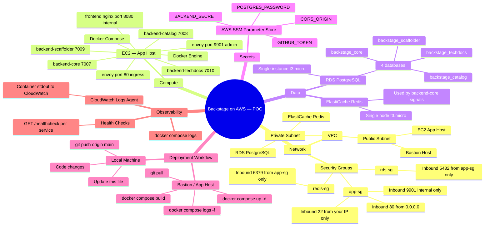

# Backstage Microservices — AWS POC Deployment

> **Purpose:** Track every code change, AWS action, and decision made while deploying this POC.
> Every time something changes — in code or on AWS — a new entry goes in the [Change Log](#change-log).
>
> **Goal of this POC:** Understand how to deploy Backstage microservices on AWS securely,
> end-to-end, from a bastion host. Single PostgreSQL, single Redis.

---

## Mind Map — What We Are Building



---

## Architecture Diagram

```
                    Your Browser
                         │
                    port 80 (HTTP)
                         ▼
              ┌──────────────────────────────────────┐
              │           EC2 — App Host             │
              │                                      │
              │  ┌──────────────────────────────┐    │
              │  │     Envoy Proxy :80           │    │  ← sole public ingress
              │  │     (envoy.yaml)              │    │
              │  │  admin UI :9901               │    │
              │  └──┬────┬────┬────┬─────────┬──┘    │
              │     │    │    │    │         │        │
              │  /api/   │    │    │  /api/  │ /*     │
              │ catalog  │    │    │ scaffol │        │
              │  search  │    │    │  der    │        │
              │  k8s     │    │  /api/      │        │
              │     │    │  /api/ techdocs  │        │
              │     │    │  (core)│         │        │
              │     ▼    ▼    ▼    ▼         ▼        │
              │  ┌──────────────────────┐ ┌────────┐ │
              │  │  backend-core  :7007 │ │frontend│ │
              │  │  backend-cat   :7008 │ │ nginx  │ │
              │  │  backend-scaf  :7009 │ │ :8080  │ │
              │  │  backend-tech  :7010 │ └────────┘ │
              │  └──────────┬───────────┘            │
              └─────────────┼────────────────────────┘
                            │
               ┌────────────┼──────────────┐
               │            │   Private    │
               │  ┌─────────▼──┐  ┌───────▼──────┐
               │  │ PostgreSQL │  │    Redis     │
               │  │ (RDS/cont) │  │(ElastiC/cont)│
               │  └────────────┘  └──────────────┘
               └────────────────────────────────────
```

> For this POC we are running all containers on a **single EC2 instance** using
> docker compose. PostgreSQL and Redis are either managed AWS services (RDS /
> ElastiCache) or run as containers — see the checklist below for the decision.

---

## Pre-Flight Checklist — AWS Setup

Complete these once before the first deployment. Mark each item done as you go.

### Network

- [ ] VPC exists (use default VPC for POC or create a dedicated one)
- [ ] At least one public subnet for EC2
- [ ] At least one private subnet for RDS/Redis (or use same subnet for POC)
- [ ] Internet Gateway attached to VPC

### Security Groups

- [ ] **app-sg** — EC2 host
  - Inbound TCP 22 from your IP (bastion access)
  - Inbound TCP 80 from `0.0.0.0/0` (Backstage UI)
  - Outbound all traffic
- [ ] **rds-sg** — PostgreSQL
  - Inbound TCP 5432 from `app-sg`
- [ ] **redis-sg** — Redis
  - Inbound TCP 6379 from `app-sg`

### Compute

- [ ] EC2 instance launched (Amazon Linux 2023 or Ubuntu 22.04, t3.medium minimum)
- [ ] Docker installed: `sudo yum install docker -y && sudo systemctl enable docker --now`
- [ ] Docker Compose v2 installed: `sudo curl -L "https://github.com/docker/compose/releases/latest/download/docker-compose-linux-x86_64" -o /usr/local/bin/docker-compose && sudo chmod +x /usr/local/bin/docker-compose`
- [ ] EC2 instance profile attached with SSM read permissions (to fetch secrets)
- [ ] Git installed and repo cloned: `git clone https://github.com/k3mahesh/backstage-micro-service.git`

### Data

- [ ] **PostgreSQL** — choose one:
  - [ ] Option A: RDS PostgreSQL 16 (t3.micro, single-AZ) — recommended
  - [ ] Option B: Run in docker compose alongside app containers (no RDS needed)
- [ ] **Redis** — choose one:
  - [ ] Option A: ElastiCache Redis (t3.micro, single node) — recommended
  - [ ] Option B: Run `redis:7-alpine` container in docker compose

> For this POC, **Option B (both in docker compose)** is the fastest path.
> Swap to Option A when validating security/networking.

### Secrets (SSM Parameter Store)

- [ ] `/backstage/poc/BACKEND_SECRET` — random 32-byte base64 string
- [ ] `/backstage/poc/GITHUB_TOKEN` — GitHub PAT with repo read scope
- [ ] `/backstage/poc/POSTGRES_PASSWORD` — strong password
- [ ] `/backstage/poc/CORS_ORIGIN` — EC2 public IP or domain e.g. `http://1.2.3.4`

### DNS / Access (Optional for POC)

- [ ] Either use EC2 public IP directly, or
- [ ] Create Route 53 A record pointing to EC2 IP

---

## Deployment Workflow

Every deployment follows this exact sequence. Do not skip steps.

### On Your Local Machine

```bash
# 1. Make your code / config changes
# 2. Update the Change Log section at the bottom of this file
# 3. Stage and commit
git add .
git commit -m "your message"
git push origin main
```

### On the Bastion / App Host

```bash
# SSH in
ssh -i your-key.pem ec2-user@<EC2_PUBLIC_IP>

# Go to the repo
cd backstage-micro-service

# Pull latest
git pull origin main

# Load secrets from SSM into environment (see .env section below)
# OR export them manually for POC

# Build images (only needed when Dockerfile or source changed)
docker compose build

# Start / restart services
docker compose up -d

# Watch logs across all services
docker compose logs -f

# Check individual service
docker compose logs -f backend-catalog
```

### Generating the .env File on the Host

For the POC, create a `.env` file on the EC2 host (never commit this):

```bash
cat > .env << 'EOF'
BACKEND_SECRET=<fetch from SSM>
GITHUB_TOKEN=<fetch from SSM>
POSTGRES_PASSWORD=<fetch from SSM>
CORS_ORIGIN=http://<EC2_PUBLIC_IP>
EOF
```

Or pull directly from SSM (requires EC2 instance profile):

```bash
export BACKEND_SECRET=$(aws ssm get-parameter --name /backstage/poc/BACKEND_SECRET --with-decryption --query Parameter.Value --output text)
export GITHUB_TOKEN=$(aws ssm get-parameter --name /backstage/poc/GITHUB_TOKEN --with-decryption --query Parameter.Value --output text)
export POSTGRES_PASSWORD=$(aws ssm get-parameter --name /backstage/poc/POSTGRES_PASSWORD --with-decryption --query Parameter.Value --output text)
export CORS_ORIGIN=$(aws ssm get-parameter --name /backstage/poc/CORS_ORIGIN --with-decryption --query Parameter.Value --output text)
```

---

## Config Changes Needed for AWS

The following changes are required in `app-config.production.yaml` before deploying.

| Setting | Current (docker-compose) | Required for AWS EC2 |
|---|---|---|
| `app.baseUrl` | `http://localhost` | `http://<EC2_PUBLIC_IP>` |
| `backend.cors.origin` | `localhost` | `http://<EC2_PUBLIC_IP>` |
| `auth.providers.guest.dangerouslyAllowOutsideDevelopment` | `true` | Keep `true` for POC only |
| `POSTGRES_HOST` | `postgres` (container name) | RDS endpoint or `postgres` if container |
| `REDIS_HOST` | not yet wired | Redis endpoint or container name |

> **Action:** Once you have the EC2 IP, update `app-config.production.yaml`
> accordingly before running `docker compose up`.

---

## Useful Commands on the Host

```bash
# See all running containers and their health
docker compose ps

# View resource usage
docker stats

# Restart a single service without touching others
docker compose restart backend-catalog

# Rebuild and restart one service only
docker compose up -d --build backend-core

# Tail logs for all services, last 50 lines
docker compose logs --tail=50 -f

# Open a shell in a running container for debugging
docker compose exec backend-catalog sh

# Check the postgres databases are created
docker compose exec postgres psql -U backstage -c '\l'

# Nuke everything and start clean (WARNING: deletes volumes)
docker compose down -v && docker compose up -d
```

---

## Health Check URLs

Once deployed, all traffic goes through Envoy on port 80:

| Check | URL | Notes |
|---|---|---|
| React SPA loads | `http://<IP>/` | Envoy → frontend nginx |
| Envoy admin | `http://<IP>:9901/` | Live cluster stats, config dump |
| Envoy cluster health | `http://<IP>:9901/clusters` | See upstream health per service |
| Backend Core | `http://<IP>/api/app/health` | Via Envoy |
| Backend Catalog | `http://<IP>/api/catalog/entities` | Via Envoy |
| Backend Scaffolder | `http://<IP>/api/scaffolder/v2/tasks` | Via Envoy |
| Backend TechDocs | `http://<IP>/api/techdocs/` | Via Envoy |

---

## Change Log

Each entry captures: **what changed in code**, **why**, and **what needs to happen on AWS** as a result.

---

### [2026-09-29] — Initial multi-platform Dockerfile fix

**Files changed:**
- `packages/app/Dockerfile`
- `packages/backend-core/Dockerfile`
- `packages/backend-catalog/Dockerfile`
- `packages/backend-scaffolder/Dockerfile`
- `packages/backend-techdocs/Dockerfile`
- `docker-compose.yaml`

**What changed:**
Added `ARG TARGETPLATFORM=linux/amd64` and `FROM --platform=${TARGETPLATFORM}` to every
Docker image stage. Added `platform: linux/amd64` to all services in docker-compose.

**Why:**
Built on Apple Silicon (arm64). Without pinning, native modules (better-sqlite3,
cpu-features) compile for arm64 and the images fail on AWS EC2 (amd64).

**AWS impact:**
None — this is a build-time fix. Images built and pushed to EC2 or ECR will now
be correct amd64 images regardless of where the build runs.

**Status:** ✅ Committed and pushed to main

---

### [2026-09-29] — Replace nginx routing with Envoy proxy as ingress controller

**Files changed:**
- `envoy.yaml` — new file, Envoy v1.31 static config
- `nginx.conf` — stripped to static-file-only server on port 8080
- `packages/app/Dockerfile` — EXPOSE changed from 80 → 8080
- `docker-compose.yaml` — added `envoy` service, renamed `nginx` → `frontend`

**What changed:**
nginx was handling two jobs: serving the React SPA and proxying all `/api/*`
traffic to backend services. Those responsibilities are now split cleanly:
- **Envoy** listens on port 80, owns all routing decisions (API + SPA)
- **frontend (nginx)** listens on port 8080 internally, serves static files only

Envoy config (`envoy.yaml`) maps each API prefix to its backend cluster, with
per-route timeouts (scaffolder gets 300 s for long-running template executions)
and WebSocket upgrade enabled for Backstage signals and log streaming.
The Envoy admin UI is available on port 9901.

**Why:**
nginx as an API gateway is hard to extend (no circuit breaking, no retries,
no observability). Envoy gives us access logging, health-check endpoints,
per-cluster stats, and a clear path to xDS dynamic config for production.

**AWS impact:**
- **Security group `app-sg`**: port 9901 should be open *only* from the bastion
  IP (or your IP) for admin access. Remove from public-facing rules in production.
- **EC2**: no new instance changes needed — Envoy runs as a docker compose service.
- Backend ports 7007–7010 remain exposed on the host for POC debugging.
  In production, remove those `ports:` entries so only Envoy (port 80) is reachable.

**Status:** ✅ Committed and pushed to main

---

### [YYYY-MM-DD] — Template for future entries

**Files changed:**
- `file/path.ext`

**What changed:**
_Describe the change._

**Why:**
_Reason for the change._

**AWS impact:**
_What, if anything, needs to happen on AWS as a result.
e.g. "Restart backend-catalog container", "Update SSM parameter", "Change security group rule"._

**Status:** ⏳ Pending / ✅ Done / ❌ Blocked

---

## Open Items / Decisions Pending

- [ ] Decide: RDS + ElastiCache vs containers for postgres and redis
- [ ] Get EC2 public IP and update `app-config.production.yaml`
- [ ] Create SSM parameters with actual secret values
- [ ] Verify EC2 instance has outbound internet access (needed for GitHub catalog locations)
- [ ] Decide whether to build images on EC2 directly or use ECR
- [ ] Confirm EC2 instance type is large enough (recommend t3.medium, 2 vCPU / 4 GB)
- [ ] Set up CloudWatch log driver in docker-compose for persistent logs (future)
