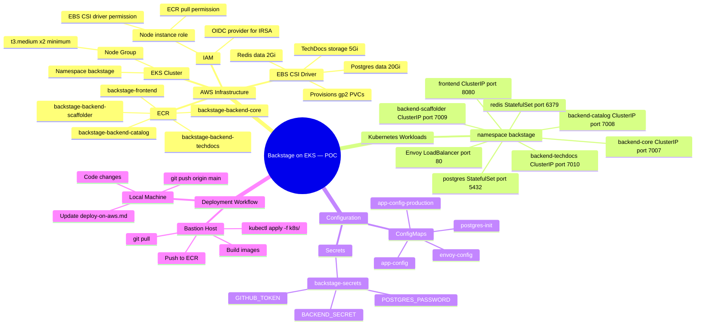

# Backstage Microservices — AWS EKS POC Deployment

> **Purpose:** Track every code change, AWS action, and decision made while deploying this POC.
> Every time something changes — in code or on AWS — a new entry goes in the [Change Log](#change-log).
>
> **Goal:** Deploy Backstage microservices on EKS securely, understand the end-to-end flow,
> and learn what each layer does. Single PostgreSQL and single Redis as containers inside the cluster.

---

## Values You Must Fill In Before Deploying

Every placeholder below will cause a deployment failure or misconfiguration if left as-is.
Work through this table top to bottom — it follows the order you'll encounter them.

| # | Placeholder | File(s) | When to fill | How to get the value |
|---|---|---|---|---|
| 1 | `<ECR_REGISTRY>` | `k8s/workloads/*.yaml` (all 5) | Before first `kubectl apply` | `aws sts get-caller-identity --query Account --output text` → `<account>.dkr.ecr.ap-south-1.amazonaws.com` |
| 2 | `<BASE64_ENCODED_BACKEND_SECRET>` | `k8s/secrets/backstage-secrets.template.yaml` | Before creating the secret | `node -e "console.log(require('crypto').randomBytes(24).toString('base64'))"` then `\| base64` |
| 3 | `<BASE64_ENCODED_GITHUB_TOKEN>` | `k8s/secrets/backstage-secrets.template.yaml` | Before creating the secret | Your GitHub PAT → `echo -n "ghp_xxx" \| base64` |
| 4 | `<BASE64_ENCODED_POSTGRES_PASSWORD>` | `k8s/secrets/backstage-secrets.template.yaml` | Before creating the secret | Any strong password → `echo -n "mypassword" \| base64` |
| 5 | `storageClassName: gp2` | `k8s/storage/pvcs.yaml` | Before applying storage | Run `kubectl get storageclass` — use `gp2` or `gp3` depending on what your cluster has |
| 6 | `<ENVOY_LB_DNS>` | `k8s/workloads/backend-*.yaml` (all 4) | **After** applying `k8s/workloads/envoy.yaml` and the NLB is provisioned | `kubectl get svc envoy -n backstage -o jsonpath='{.status.loadBalancer.ingress[0].hostname}'` |

### Quick fill-in commands on the bastion host

```bash
# ── 1. Set your ECR registry ───────────────────────────────────────────────────
export AWS_ACCOUNT=$(aws sts get-caller-identity --query Account --output text)
export AWS_REGION=ap-south-1
export ECR_REGISTRY=$AWS_ACCOUNT.dkr.ecr.$AWS_REGION.amazonaws.com

# Replace <ECR_REGISTRY> in all 5 workload files at once
for f in frontend backend-core backend-catalog backend-scaffolder backend-techdocs; do
  python3 -c "
content = open('k8s/workloads/$f.yaml').read()
open('k8s/workloads/$f.yaml','w').write(content.replace('<ECR_REGISTRY>', '$ECR_REGISTRY'))
"
done

# ── 2-4. Create the K8s secret directly from SSM (skip the template file) ─────
kubectl create secret generic backstage-secrets \
  --namespace backstage \
  --from-literal=BACKEND_SECRET="$(aws ssm get-parameter \
    --name /backstage/poc/BACKEND_SECRET --with-decryption \
    --query Parameter.Value --output text)" \
  --from-literal=GITHUB_TOKEN="$(aws ssm get-parameter \
    --name /backstage/poc/GITHUB_TOKEN --with-decryption \
    --query Parameter.Value --output text)" \
  --from-literal=POSTGRES_PASSWORD="$(aws ssm get-parameter \
    --name /backstage/poc/POSTGRES_PASSWORD --with-decryption \
    --query Parameter.Value --output text)"

# ── 5. Check which StorageClass your cluster has ──────────────────────────────
kubectl get storageclass
# If you see gp3 but pvcs.yaml says gp2, update it:
# python3 -c "
# content = open('k8s/storage/pvcs.yaml').read()
# open('k8s/storage/pvcs.yaml','w').write(content.replace('gp2','gp3'))
# "

# ── 6. After Envoy LB is provisioned, fill in the LB DNS ──────────────────────
export LB_DNS=$(kubectl get svc envoy -n backstage \
  -o jsonpath='{.status.loadBalancer.ingress[0].hostname}')
echo "LB DNS: $LB_DNS"

for f in backend-core backend-catalog backend-scaffolder backend-techdocs; do
  python3 -c "
content = open('k8s/workloads/$f.yaml').read()
open('k8s/workloads/$f.yaml','w').write(content.replace('<ENVOY_LB_DNS>', '$LB_DNS'))
"
done

# Re-apply the updated manifests
kubectl apply -f k8s/workloads/backend-core.yaml
kubectl apply -f k8s/workloads/backend-catalog.yaml
kubectl apply -f k8s/workloads/backend-scaffolder.yaml
kubectl apply -f k8s/workloads/backend-techdocs.yaml
```

> **Note:** Steps 1 and 6 modify your local manifest files. If you re-clone the repo,
> run them again. The template files in git keep `<ECR_REGISTRY>` and `<ENVOY_LB_DNS>`
> as placeholders on purpose — they must match your environment.

---

## Mind Map — Full Picture



---

## Architecture Diagram

```
           Internet / Your Browser
                    │
               port 80 (HTTP)
                    │
            ┌───────▼──────────────────────────────────────┐
            │              AWS EKS Cluster                  │
            │           Namespace: backstage                │
            │                                              │
            │  ┌─────────────────────────┐                 │
            │  │  Envoy — LoadBalancer   │◄── AWS ELB/NLB  │
            │  │  (envoy.yaml ConfigMap) │                 │
            │  └──┬──────┬──────┬───┬───┘                 │
            │     │      │      │   │                      │
            │  /api/  /api/  /api/ /*                      │
            │  cata  scaf   core                           │
            │  log   folder                                │
            │  search                                      │
            │  k8s                                         │
            │     │      │      │   │                      │
            │  ┌──▼─┐ ┌──▼──┐ ┌▼─┐ ┌▼──────────┐         │
            │  │cat │ │scaf │ │cor│ │ frontend  │         │
            │  │log │ │fold │ │e  │ │ nginx:8080│         │
            │  │7008│ │7009 │ │700│ └───────────┘         │
            │  └──┬─┘ └──┬──┘ └┬─┘                        │
            │  ┌──▼──────▼─────▼──────────────────────┐   │
            │  │        postgres:5432  redis:6379       │   │
            │  │        StatefulSet    StatefulSet      │   │
            │  └──────────────────────────────────────┘   │
            │                                              │
            │  ┌─────────────────────────────────────┐    │
            │  │     EBS Volumes (gp2 PVCs)           │    │
            │  │  postgres-data 20Gi                  │    │
            │  │  redis-data 2Gi                      │    │
            │  │  techdocs-storage 5Gi                │    │
            │  └─────────────────────────────────────┘    │
            └──────────────────────────────────────────────┘
```

---

## Directory Layout

```
k8s/
├── namespace.yaml                      ← create namespace first
├── configmaps/
│   ├── app-config.yaml                 ← base Backstage config (ConfigMap)
│   ├── app-config-production.yaml      ← production overrides (ConfigMap)
│   ├── envoy.yaml                      ← Envoy proxy routing rules (ConfigMap)
│   └── postgres-init.yaml              ← DB init script (ConfigMap)
├── secrets/
│   ├── backstage-secrets.template.yaml ← COMMIT: placeholder values
│   └── .gitignore                      ← ignores backstage-secrets.yaml
├── storage/
│   └── pvcs.yaml                       ← postgres, redis, techdocs PVCs
└── workloads/
    ├── postgres.yaml                   ← StatefulSet + headless Service
    ├── redis.yaml                      ← StatefulSet + headless Service
    ├── frontend.yaml                   ← Deployment + ClusterIP Service
    ├── backend-core.yaml               ← Deployment + ClusterIP Service
    ├── backend-catalog.yaml            ← Deployment + ClusterIP Service
    ├── backend-scaffolder.yaml         ← Deployment + ClusterIP Service
    ├── backend-techdocs.yaml           ← Deployment + ClusterIP Service
    └── envoy.yaml                      ← Deployment + LoadBalancer Service
```

---

## Pre-Flight Checklist — AWS Setup

### EKS Cluster

- [ ] EKS cluster exists (version 1.29+)
- [ ] `kubectl` configured: `aws eks update-kubeconfig --region ap-south-1 --name <cluster-name>`
- [ ] Node group has at least 2 × t3.medium nodes
- [ ] EBS CSI Driver add-on installed (needed for PVC provisioning)
  ```bash
  aws eks create-addon --cluster-name <name> --addon-name aws-ebs-csi-driver --region ap-south-1
  ```
- [ ] Node IAM role has `AmazonEBSCSIDriverPolicy` attached

### ECR Repositories

Create one repo per image:
```bash
for svc in frontend backend-core backend-catalog backend-scaffolder backend-techdocs; do
  aws ecr create-repository \
    --repository-name backstage-$svc \
    --region ap-south-1 \
    --image-scanning-configuration scanOnPush=true
done
```

- [ ] `backstage-frontend`
- [ ] `backstage-backend-core`
- [ ] `backstage-backend-catalog`
- [ ] `backstage-backend-scaffolder`
- [ ] `backstage-backend-techdocs`

### Node Group — ECR Pull Permission

- [ ] Node instance role has `AmazonEC2ContainerRegistryReadOnly` attached

---

## Deployment Workflow

Follow this exact order every time. Steps depend on each other.

### Step 1 — On Your Local Machine

```bash
# Make code changes, then:
# 1. Update the Change Log at the bottom of this file
# 2. Commit and push
git add .
git commit -m "your message"
git push origin main
```

### Step 2 — On the Bastion Host: Build & Push Images

A dedicated script handles everything — ECR login, React pre-build, image build, and push:

```bash
# Pull latest code
cd backstage-micro-service
git pull origin main

# First time only: create ECR repos if they don't exist
./scripts/build-push-ecr.sh --create-repos --build-only

# Build all images and push to ECR (standard run)
./scripts/build-push-ecr.sh

# Options:
#   --tag v1.2.3          tag with a specific version (also tags latest)
#   --service frontend    build and push a single service only
#   --build-only          skip push (useful for testing the build)
#   --push-only           skip build (re-push already-built images)
#   --region eu-west-1    override AWS region
#   --create-repos        create ECR repos before building (safe to re-run)
```

The script:
- Auto-detects your AWS account ID and ECR registry URL
- Tags images with both `latest` and the current git SHA
- Runs `yarn workspace app build` before building the frontend image (required — the Dockerfile copies `packages/app/dist/` which must exist on the host)
- Continues building remaining services if one fails, then reports all failures at the end

### Step 3 — On the Bastion Host: Update Image URIs in Manifests

Replace the `<ECR_REGISTRY>` placeholder in each workload manifest:

```bash
# One-liner to replace in all workload files
sed -i "s|<ECR_REGISTRY>|$ECR_REGISTRY|g" k8s/workloads/*.yaml
```

### Step 4 — On the Bastion Host: Create the Secret

```bash
# Never commit this — it is .gitignored
kubectl create secret generic backstage-secrets \
  --namespace backstage \
  --from-literal=BACKEND_SECRET=$(aws ssm get-parameter \
    --name /backstage/poc/BACKEND_SECRET --with-decryption \
    --query Parameter.Value --output text) \
  --from-literal=GITHUB_TOKEN=$(aws ssm get-parameter \
    --name /backstage/poc/GITHUB_TOKEN --with-decryption \
    --query Parameter.Value --output text) \
  --from-literal=POSTGRES_PASSWORD=$(aws ssm get-parameter \
    --name /backstage/poc/POSTGRES_PASSWORD --with-decryption \
    --query Parameter.Value --output text)
```

### Step 5 — Deploy everything with one script

```bash
# Dry-run first to validate manifests and check for missed placeholders
./scripts/deploy-k8s.sh --dry-run

# Full deploy (applies in order, waits for each layer, patches LB DNS automatically)
./scripts/deploy-k8s.sh
```

The script handles steps 5 and 6 automatically:
- Applies manifests in dependency order (namespace → configmaps → storage → postgres/redis → backends → frontend → envoy)
- Waits for postgres and redis to be ready before starting backends
- Waits for the Envoy NLB to get its DNS (up to 5 minutes)
- Patches `APP_BASE_URL` and `CORS_ORIGIN` in all backends with the LB DNS
- Prints a pod/service summary and the final URL at the end

Other useful modes:
```bash
./scripts/deploy-k8s.sh --rollout       # force rolling restart of all deployments
./scripts/deploy-k8s.sh --skip-wait     # apply everything without waiting (useful in CI)
./scripts/deploy-k8s.sh --namespace myns # deploy to a different namespace
```

---

## Useful kubectl Commands

```bash
# See all pods and their status
kubectl get pods -n backstage

# Watch pods come up live
kubectl get pods -n backstage -w

# Tail logs for a service
kubectl logs -f deployment/backend-catalog -n backstage

# Tail logs for postgres
kubectl logs -f statefulset/postgres -n backstage

# Shell into a running pod for debugging
kubectl exec -it deployment/backend-catalog -n backstage -- sh

# Check postgres databases are created
kubectl exec -it statefulset/postgres -n backstage -- \
  psql -U backstage -c '\l'

# Describe a pod to see events / errors
kubectl describe pod -l app=backend-core -n backstage

# Restart a deployment (e.g. after config change)
kubectl rollout restart deployment/backend-catalog -n backstage

# Force re-pull latest image
kubectl rollout restart deployment/frontend -n backstage

# Delete and re-apply everything (nuclear option)
kubectl delete namespace backstage
kubectl apply -f k8s/namespace.yaml
# ... re-run steps 2-6 above
```

---

## Health Check URLs

All traffic goes through the Envoy LB. Use `$LB_DNS` from Step 6.

| Check | URL |
|---|---|
| React SPA | `http://$LB_DNS/` |
| Envoy admin (internal only) | `kubectl port-forward svc/envoy-admin 9901:9901 -n backstage` then `http://localhost:9901` |
| Envoy cluster health | `http://localhost:9901/clusters` |
| Catalog API | `http://$LB_DNS/api/catalog/entities` |
| Scaffolder API | `http://$LB_DNS/api/scaffolder/v2/tasks` |
| TechDocs API | `http://$LB_DNS/api/techdocs/` |

---

## SSM Parameters to Create

```bash
# Generate BACKEND_SECRET
SECRET=$(node -e "console.log(require('crypto').randomBytes(24).toString('base64'))")

aws ssm put-parameter --name /backstage/poc/BACKEND_SECRET \
  --value "$SECRET" --type SecureString --region ap-south-1

aws ssm put-parameter --name /backstage/poc/GITHUB_TOKEN \
  --value "ghp_yourtoken" --type SecureString --region ap-south-1

aws ssm put-parameter --name /backstage/poc/POSTGRES_PASSWORD \
  --value "yourpassword" --type SecureString --region ap-south-1
```

---

## Change Log

---

### [2026-09-29] — Multi-platform Dockerfile fix

**Files changed:** All 5 Dockerfiles, `docker-compose.yaml`

**What changed:** Added `ARG TARGETPLATFORM=linux/amd64` and `FROM --platform=...`
to every image stage. Added `platform: linux/amd64` to docker-compose services.

**Why:** Prevents arm64/amd64 mismatch when building on Apple Silicon for EKS (amd64).

**AWS impact:** None — build-time fix. Images pushed to ECR will be correct amd64.

**Status:** ✅ Done

---

### [2026-09-29] — Replace nginx routing with Envoy proxy as ingress

**Files changed:** `envoy.yaml` (new), `nginx.conf`, `packages/app/Dockerfile`,
`docker-compose.yaml`

**What changed:** nginx now only serves static files on port 8080.
Envoy handles all routing on port 80 with per-route timeouts and WebSocket support.

**Why:** Envoy gives us better observability, per-service timeouts, and a clean
separation between ingress and static file serving.

**AWS impact:**
- In docker-compose: Envoy listens on port 80 of the host
- In EKS: Envoy Service type=LoadBalancer creates an AWS NLB

**Status:** ✅ Done

---

### [2026-09-29] — Move deployment target from docker-compose to EKS

**Files changed:**
- `k8s/` directory — all manifests (new)
- `app-config.production.yaml` — added `APP_BASE_URL` env var support
- `docker-compose.yaml` — added `APP_BASE_URL: http://localhost` to all backends
- `deploy-on-aws.md` — complete rewrite for EKS workflow

**What changed:**
Created a full `k8s/` directory with all Kubernetes manifests:
- `namespace.yaml` — `backstage` namespace
- `configmaps/` — app-config, envoy config, postgres init script as ConfigMaps
- `secrets/` — secret template (committed) + .gitignore
- `storage/` — PVCs for postgres (20Gi), redis (2Gi), techdocs (5Gi)
- `workloads/` — StatefulSets for postgres + redis, Deployments for all app services,
  Envoy as LoadBalancer exposing port 80 via AWS NLB

**Why:**
docker-compose is local dev only. EKS is the actual deployment target.
PostgreSQL and Redis run as single-replica containers inside the cluster (POC approach).

**AWS impact:**
- **EKS cluster** must exist with EBS CSI driver add-on installed
- **ECR repositories** must be created for each image (see pre-flight checklist)
- **Node IAM role** must have ECR pull + EBS CSI permissions
- **Envoy LoadBalancer Service** will create an AWS NLB — note the DNS after deploy
- **SSM parameters** must be created before creating the K8s secret

**Status:** ✅ Manifests committed — pending first EKS deployment

---

### [2026-09-29] — Add deploy-k8s.sh script

**Files changed:** `scripts/deploy-k8s.sh` (new)

**What changed:**
Single script that deploys all K8s manifests in the correct dependency order,
waits for each layer to be healthy before moving to the next, and automatically
patches `APP_BASE_URL` once the Envoy LoadBalancer gets its DNS from AWS.

**Why:**
Applying manifests out of order (e.g. backends before postgres) causes pod
crash-loops that are confusing to debug. The script ensures postgres and redis
are fully ready before any backend starts, and handles the Envoy LB DNS
chicken-and-egg problem automatically.

**AWS impact:**
Envoy `LoadBalancer` Service triggers AWS to provision an NLB. DNS is assigned
within 1-3 minutes. The script waits and patches APP_BASE_URL automatically.

**Status:** ✅ Done

---

### [2026-09-29] — Add build-push-ecr.sh script

**Files changed:** `scripts/build-push-ecr.sh` (new)

**What changed:**
Single script to build all 5 Docker images for `linux/amd64` and push them to ECR.
Handles ECR login, React SPA pre-build, parallel tagging (git SHA + latest),
optional single-service mode, and error reporting.

**Why:**
Previously required manually running 5+ docker build/push commands. The script
also handles the frontend pre-build step (`yarn workspace app build`) which is
easy to forget and causes a silent empty nginx image.

**AWS impact:**
None directly. Requires ECR repositories to exist — run with `--create-repos`
on first use.

**Status:** ✅ Done

---

### [YYYY-MM-DD] — Template for future entries

**Files changed:**
- `file/path.ext`

**What changed:**
_Describe the change._

**Why:**
_Reason._

**AWS impact:**
_What needs to happen on AWS as a result.
e.g.: "kubectl rollout restart deployment/backend-catalog", "ECR image re-push",
"Update SSM parameter", "EKS node group scaling"._

**Status:** ⏳ Pending / ✅ Done / ❌ Blocked

---

## Open Items

- [ ] **EKS cluster** — create with EBS CSI driver add-on
- [ ] **ECR repos** — create 5 repos (see pre-flight checklist)
- [ ] **Node IAM role** — attach ECR + EBS CSI policies
- [ ] **SSM parameters** — create BACKEND_SECRET, GITHUB_TOKEN, POSTGRES_PASSWORD
- [ ] **Build images** — run the build+push script on bastion
- [ ] **Replace `<ECR_REGISTRY>`** in all `k8s/workloads/*.yaml` files
- [ ] **Get Envoy LB DNS** — update APP_BASE_URL in backend deployments after first apply
- [ ] **StorageClass** — verify cluster has `gp2` or change to `gp3` in `k8s/storage/pvcs.yaml`
- [ ] **Decide** — HTTPS via ACM + NLB or HTTP-only for POC
