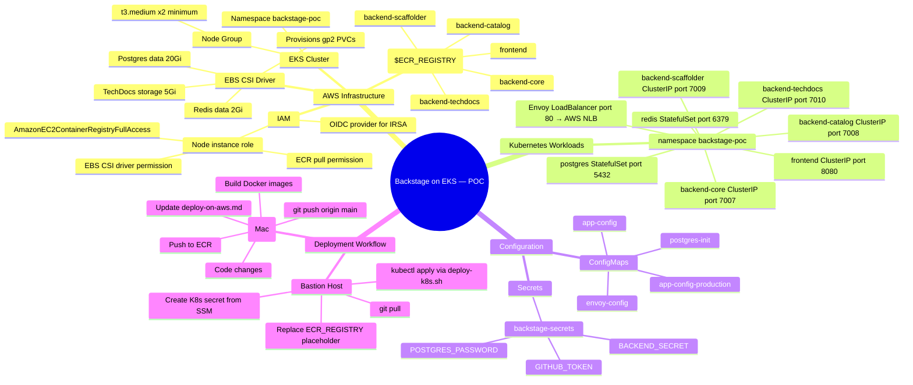

# Backstage Microservices — AWS EKS POC Deployment

> **Purpose:** Track every code change, AWS action, and decision made while deploying this POC.
> Every time something changes — in code or on AWS — a new entry goes in the [Change Log](#change-log).
>
> **Goal:** Deploy Backstage microservices on EKS securely, understand the end-to-end flow,
> and learn what each layer does. Single PostgreSQL and single Redis as containers inside the cluster.

---

## Values You Must Fill In Before Deploying

Every placeholder below will cause a deployment failure or misconfiguration if left as-is.
Work through this table top to bottom — it follows the order you'll encounter them.

| # | Placeholder | File(s) | When to fill | How to get the value |
|---|---|---|---|---|
| 1 | `<ECR_REGISTRY>` | `k8s/workloads/*.yaml` (all 5) | Before first `kubectl apply` | `aws sts get-caller-identity --query Account --output text` → `<account>.dkr.ecr.ap-south-1.amazonaws.com` |
| 2 | `<BASE64_ENCODED_BACKEND_SECRET>` | `k8s/secrets/backstage-secrets.template.yaml` | Before creating the secret | `openssl rand -base64 24 \| base64` |
| 3 | `<BASE64_ENCODED_GITHUB_TOKEN>` | `k8s/secrets/backstage-secrets.template.yaml` | Before creating the secret | Your GitHub PAT → `echo -n "ghp_xxx" \| base64` |
| 4 | `<BASE64_ENCODED_POSTGRES_PASSWORD>` | `k8s/secrets/backstage-secrets.template.yaml` | Before creating the secret | Any strong password → `echo -n "mypassword" \| base64` |
| 5 | `storageClassName: gp2` | `k8s/storage/pvcs.yaml` | Before applying storage | Run `kubectl get storageclass` — use `gp2` or `gp3` depending on what your cluster has |
| 6 | `<ENVOY_LB_DNS>` | `k8s/workloads/backend-*.yaml` (all 4) | **After** applying `k8s/workloads/envoy.yaml` and the NLB is provisioned | `kubectl get svc envoy -n backstage-poc -o jsonpath='{.status.loadBalancer.ingress[0].hostname}'` |

### Quick fill-in commands on the bastion host

```bash
# ── 1. Resolve ECR registry from your AWS account ────────────────────────────
export AWS_ACCOUNT=$(aws sts get-caller-identity --query Account --output text)
export AWS_REGION=ap-south-1
export ECR_REGISTRY=$AWS_ACCOUNT.dkr.ecr.$AWS_REGION.amazonaws.com

# Replace <ECR_REGISTRY> in all 5 workload files at once
for f in frontend backend-core backend-catalog backend-scaffolder backend-techdocs; do
  python3 -c "
content = open('k8s/workloads/$f.yaml').read()
open('k8s/workloads/$f.yaml','w').write(content.replace('<ECR_REGISTRY>', '$ECR_REGISTRY'))
"
done

# ── 2-4. Create the K8s secret directly from SSM (skip the template file) ─────
kubectl create secret generic backstage-secrets \
  --namespace backstage-poc \
  --from-literal=BACKEND_SECRET="$(aws ssm get-parameter \
    --name /backstage/poc/BACKEND_SECRET --with-decryption \
    --query Parameter.Value --output text)" \
  --from-literal=GITHUB_TOKEN="$(aws ssm get-parameter \
    --name /backstage/poc/GITHUB_TOKEN --with-decryption \
    --query Parameter.Value --output text)" \
  --from-literal=POSTGRES_PASSWORD="$(aws ssm get-parameter \
    --name /backstage/poc/POSTGRES_PASSWORD --with-decryption \
    --query Parameter.Value --output text)"

# ── 5. Check which StorageClass your cluster has ──────────────────────────────
kubectl get storageclass
# If you see gp3 but pvcs.yaml says gp2, update it:
# python3 -c "
# content = open('k8s/storage/pvcs.yaml').read()
# open('k8s/storage/pvcs.yaml','w').write(content.replace('gp2','gp3'))
# "

# ── 6. After Envoy LB is provisioned, fill in the LB DNS ──────────────────────
# (deploy-k8s.sh does this automatically — manual fallback below)
export LB_DNS=$(kubectl get svc envoy -n backstage-poc \
  -o jsonpath='{.status.loadBalancer.ingress[0].hostname}')
echo "LB DNS: $LB_DNS"

for f in backend-core backend-catalog backend-scaffolder backend-techdocs; do
  python3 -c "
content = open('k8s/workloads/$f.yaml').read()
open('k8s/workloads/$f.yaml','w').write(content.replace('<ENVOY_LB_DNS>', '$LB_DNS'))
"
done

# Re-apply the updated manifests
kubectl apply -f k8s/workloads/backend-core.yaml -n backstage-poc
kubectl apply -f k8s/workloads/backend-catalog.yaml -n backstage-poc
kubectl apply -f k8s/workloads/backend-scaffolder.yaml -n backstage-poc
kubectl apply -f k8s/workloads/backend-techdocs.yaml -n backstage-poc
```

> **Note:** Steps 1 and 6 modify your local manifest files. If you re-clone the repo,
> run them again. The template files in git keep `<ECR_REGISTRY>` and `<ENVOY_LB_DNS>`
> as placeholders on purpose — they must match your environment.

---

## Mind Map — Full Picture



---

## Architecture Diagram

```
           Internet / Your Browser
                    │
               port 80 (HTTP)
                    │
            ┌───────▼──────────────────────────────────────┐
            │              AWS EKS Cluster                  │
            │          Namespace: backstage-poc             │
            │                                              │
            │  ┌─────────────────────────┐                 │
            │  │  Envoy — LoadBalancer   │◄── AWS NLB      │
            │  │  (envoy-config ConfigMap│                 │
            │  └──┬──────┬──────┬───┬───┘                 │
            │     │      │      │   │                      │
            │  /api/  /api/  /api/ /*                      │
            │  cata  scaf   core                           │
            │  log   folder /api/                          │
            │  search techdocs                             │
            │  k8s                                         │
            │     │      │      │   │                      │
            │  ┌──▼─┐ ┌──▼──┐ ┌▼─┐ ┌▼──────────┐         │
            │  │cat │ │scaf │ │cor│ │ frontend  │         │
            │  │log │ │fold │ │e  │ │ nginx:8080│         │
            │  │7008│ │7009 │ │700│ └───────────┘         │
            │  └──┬─┘ └──┬──┘ └┬─┘                        │
            │  ┌──▼──────▼─────▼──────────────────────┐   │
            │  │        postgres:5432  redis:6379       │   │
            │  │        StatefulSet    StatefulSet      │   │
            │  └──────────────────────────────────────┘   │
            │                                              │
            │  ┌─────────────────────────────────────┐    │
            │  │     EBS Volumes (gp2 PVCs)           │    │
            │  │  postgres-data 20Gi                  │    │
            │  │  redis-data 2Gi                      │    │
            │  │  techdocs-storage 5Gi                │    │
            │  └─────────────────────────────────────┘    │
            └──────────────────────────────────────────────┘
```

---

## Directory Layout

```
k8s/
├── namespace.yaml                      ← creates namespace backstage-poc
├── configmaps/
│   ├── app-config.yaml                 ← base Backstage config (ConfigMap)
│   ├── app-config-production.yaml      ← production overrides (ConfigMap)
│   ├── envoy.yaml                      ← Envoy proxy routing rules (ConfigMap)
│   └── postgres-init.yaml              ← DB init script (ConfigMap)
├── secrets/
│   ├── backstage-secrets.template.yaml ← COMMIT: placeholder values
│   └── .gitignore                      ← ignores backstage-secrets.yaml
├── storage/
│   └── pvcs.yaml                       ← postgres, redis, techdocs PVCs
└── workloads/
    ├── postgres.yaml                   ← StatefulSet + headless Service
    ├── redis.yaml                      ← StatefulSet + headless Service
    ├── frontend.yaml                   ← Deployment + ClusterIP Service
    ├── backend-core.yaml               ← Deployment + ClusterIP Service
    ├── backend-catalog.yaml            ← Deployment + ClusterIP Service
    ├── backend-scaffolder.yaml         ← Deployment + ClusterIP Service
    ├── backend-techdocs.yaml           ← Deployment + ClusterIP Service
    └── envoy.yaml                      ← Deployment + LoadBalancer Service (NLB)

scripts/
├── build-push-ecr.sh                   ← build all images + push to ECR (run on Mac)
└── deploy-k8s.sh                       ← deploy all K8s manifests in order (run on bastion)
```

---

## Pre-Flight Checklist — AWS Setup

### EKS Cluster

- [ ] EKS cluster exists (version 1.29+)
- [ ] `kubectl` configured: `aws eks update-kubeconfig --region ap-south-1 --name <cluster-name>`
- [ ] Node group has at least 2 × t3.medium nodes
- [ ] EBS CSI Driver add-on installed (needed for PVC provisioning)
  ```bash
  aws eks create-addon --cluster-name <name> --addon-name aws-ebs-csi-driver --region ap-south-1
  ```
- [ ] Node IAM role has `AmazonEBSCSIDriverPolicy` attached
- [ ] Node IAM role has `AmazonEC2ContainerRegistryFullAccess` attached (for ECR pull)

### ECR Repositories

Create one repo per image (names without the `backstage-` prefix):
```bash
for svc in frontend backend-core backend-catalog backend-scaffolder backend-techdocs; do
  aws ecr create-repository \
    --repository-name $svc \
    --region ap-south-1 \
    --image-scanning-configuration scanOnPush=true
done
```

- [x] `frontend` — ✅ created + image pushed (`bc44691` / `latest`)
- [x] `backend-core` — ✅ created + image pushed
- [x] `backend-catalog` — ✅ created + image pushed
- [x] `backend-scaffolder` — ✅ created + image pushed
- [x] `backend-techdocs` — ✅ created + image pushed

---

## Deployment Workflow

Follow this exact order every time. Steps depend on each other.

### Step 1 — On Your Mac: Make Changes and Build Images

```bash
# Make code changes, then build and push all images
./scripts/build-push-ecr.sh

# Options:
#   --tag v1.2.3          tag with a specific version (also tags latest)
#   --service frontend    build and push a single service only
#   --build-only          skip push (useful for testing the build)
#   --push-only           skip build (re-push already-built images)
#   --region eu-west-1    override AWS region
#   --create-repos        create ECR repos before building (safe to re-run)

# After building, commit and push code
git add .
git commit -m "your message"
git push origin main
```

The script:
- Auto-detects your AWS account ID and ECR registry URL
- Tags images with both `latest` and the current git SHA
- Frontend uses a multi-stage Docker build — Node.js / yarn run **inside Docker**, nothing to install on the host
- Continues building remaining services if one fails, then reports all failures at the end

> **Prerequisites on your Mac:** AWS CLI credentials with ECR push access + Docker Desktop running.
> No Node.js needed — the frontend Dockerfile handles `yarn install` and `yarn build` internally.

### Step 2 — On the Bastion Host: Pull Code and Replace Placeholders

```bash
cd backstage-micro-service
git pull origin main

# Replace <ECR_REGISTRY> in all 5 workload manifests
export AWS_ACCOUNT=$(aws sts get-caller-identity --query Account --output text)
export AWS_REGION=ap-south-1
export ECR_REGISTRY=$AWS_ACCOUNT.dkr.ecr.$AWS_REGION.amazonaws.com
for f in frontend backend-core backend-catalog backend-scaffolder backend-techdocs; do
  python3 -c "
content = open('k8s/workloads/$f.yaml').read()
open('k8s/workloads/$f.yaml','w').write(content.replace('<ECR_REGISTRY>', '$ECR_REGISTRY'))
"
done
```

### Step 3 — On the Bastion Host: Create the Secret

Only needed once. Skip if the secret already exists in the `backstage-poc` namespace.

```bash
kubectl create secret generic backstage-secrets \
  --namespace backstage-poc \
  --from-literal=BACKEND_SECRET=$(aws ssm get-parameter \
    --name /backstage/poc/BACKEND_SECRET --with-decryption \
    --query Parameter.Value --output text) \
  --from-literal=GITHUB_TOKEN=$(aws ssm get-parameter \
    --name /backstage/poc/GITHUB_TOKEN --with-decryption \
    --query Parameter.Value --output text) \
  --from-literal=POSTGRES_PASSWORD=$(aws ssm get-parameter \
    --name /backstage/poc/POSTGRES_PASSWORD --with-decryption \
    --query Parameter.Value --output text)
```

### Step 4 — On the Bastion Host: Deploy Everything

```bash
# Dry-run first to validate manifests and check for missed placeholders
./scripts/deploy-k8s.sh --dry-run

# Full deploy (applies in order, waits for each layer, patches LB DNS automatically)
./scripts/deploy-k8s.sh
```

The script handles everything automatically:
- Applies manifests in dependency order: namespace → configmaps → storage → postgres/redis → backends → frontend → envoy
- Waits for postgres and redis to be ready before starting backends
- Waits for the Envoy NLB to get its DNS (up to 5 minutes)
- Patches `APP_BASE_URL` and `CORS_ORIGIN` in all backends with the LB DNS
- Prints a pod/service summary and the final URL at the end

Other useful modes:
```bash
./scripts/deploy-k8s.sh --rollout       # force rolling restart of all deployments
./scripts/deploy-k8s.sh --skip-wait     # apply everything without waiting
./scripts/deploy-k8s.sh --namespace myns # deploy to a different namespace
```

---

## Useful kubectl Commands

```bash
# See all pods and their status
kubectl get pods -n backstage-poc

# Watch pods come up live
kubectl get pods -n backstage-poc -w

# Tail logs for a service
kubectl logs -f deployment/backend-catalog -n backstage-poc

# Tail logs for postgres
kubectl logs -f statefulset/postgres -n backstage-poc

# Shell into a running pod for debugging
kubectl exec -it deployment/backend-catalog -n backstage-poc -- sh

# Check postgres databases are created
kubectl exec -it statefulset/postgres -n backstage-poc -- \
  psql -U backstage -c '\l'

# Describe a pod to see events / errors
kubectl describe pod -l app=backend-core -n backstage-poc

# Restart a deployment (e.g. after config change)
kubectl rollout restart deployment/backend-catalog -n backstage-poc

# Force re-pull latest image
kubectl rollout restart deployment/frontend -n backstage-poc

# Delete and re-apply everything (nuclear option — removes all POC resources)
kubectl delete namespace backstage-poc
kubectl apply -f k8s/namespace.yaml
# ... re-run steps 2-4 above
```

---

## Health Check URLs

All traffic goes through the Envoy NLB. Use `$LB_DNS` from the deploy script output.

| Check | URL |
|---|---|
| React SPA | `http://$LB_DNS/` |
| Envoy admin (internal only) | `kubectl port-forward svc/envoy-admin 9901:9901 -n backstage-poc` then `http://localhost:9901` |
| Envoy cluster health | `http://localhost:9901/clusters` |
| Catalog API | `http://$LB_DNS/api/catalog/entities` |
| Scaffolder API | `http://$LB_DNS/api/scaffolder/v2/tasks` |
| TechDocs API | `http://$LB_DNS/api/techdocs/` |

---

## SSM Parameters — What They Are and How to Create Them

The K8s secret is populated from three SSM parameters. You must create them **before** running
`kubectl create secret`. Here is what each value is and how to get it.

---

### BACKEND_SECRET

A random string used by Backstage internally to sign auth tokens and session cookies.
The value doesn't matter — it just needs to be random and the same across all backend pods.

```bash
# Generate a random value
openssl rand -base64 24
# Example output: 7K2mXpQzR9vLnJwYcT4sBdHuFgA1eN3i

# Store it in SSM
aws ssm put-parameter \
  --name /backstage/poc/BACKEND_SECRET \
  --value "$(openssl rand -base64 24)" \
  --type SecureString \
  --region ap-south-1
```

---

### GITHUB_TOKEN

A GitHub Personal Access Token (PAT) so Backstage can read your GitHub org —
used by the catalog (repositories, teams, users) and the scaffolder (create repos from templates).

**How to generate:**
1. Go to **GitHub → Settings → Developer Settings → Personal Access Tokens → Tokens (classic)**
2. Click **Generate new token (classic)**
3. Select scopes: `repo`, `read:org`, `read:user`
4. Copy the token (starts with `ghp_`)

> If you don't have GitHub integration yet, put a dummy value — the catalog won't sync
> but the rest of the app will still start.

```bash
aws ssm put-parameter \
  --name /backstage/poc/GITHUB_TOKEN \
  --value "ghp_your_actual_token_here" \
  --type SecureString \
  --region ap-south-1
```

---

### POSTGRES_PASSWORD

The password for the PostgreSQL database running inside the cluster. You choose this —
it just needs to match what the `postgres` StatefulSet uses (set via the same K8s secret).

```bash
# Generate a random password
openssl rand -base64 16
# Example: mK9xPqR2vLnJ4wYc

# Store it in SSM
aws ssm put-parameter \
  --name /backstage/poc/POSTGRES_PASSWORD \
  --value "$(openssl rand -base64 16)" \
  --type SecureString \
  --region ap-south-1
```

---

### Verify all three parameters exist

```bash
aws ssm get-parameters \
  --names /backstage/poc/BACKEND_SECRET /backstage/poc/GITHUB_TOKEN /backstage/poc/POSTGRES_PASSWORD \
  --with-decryption \
  --region ap-south-1 \
  --query 'Parameters[*].{Name:Name,Value:Value}'
```

---

### Why SSM and not hardcode the values?

SSM keeps secrets out of your shell history, out of git, and gives you a single place to
rotate them later. The bastion's IAM role already has SSM read access. The `kubectl create secret`
command pulls values directly from SSM and injects them into Kubernetes — values never touch a
file on disk.

---

## Change Log

---

### [2026-09-29] — Multi-platform Dockerfile fix

**Files changed:** All 5 Dockerfiles, `docker-compose.yaml`

**What changed:** Added `ARG TARGETPLATFORM=linux/amd64` and `FROM --platform=...`
to every image stage. Added `platform: linux/amd64` to docker-compose services.

**Why:** Prevents arm64/amd64 mismatch when building on Apple Silicon for EKS (amd64).

**AWS impact:** None — build-time fix. Images pushed to ECR will be correct amd64.

**Status:** ✅ Done

---

### [2026-09-29] — Replace nginx routing with Envoy proxy as ingress

**Files changed:** `envoy.yaml` (new), `nginx.conf`, `packages/app/Dockerfile`,
`docker-compose.yaml`

**What changed:** nginx now only serves static files on port 8080.
Envoy handles all routing on port 80 with per-route timeouts and WebSocket support.

**Why:** Envoy gives better observability, per-service timeouts, and a clean
separation between ingress and static file serving.

**AWS impact:**
- In docker-compose: Envoy listens on port 80 of the host
- In EKS: Envoy Service type=LoadBalancer creates an AWS NLB

**Status:** ✅ Done

---

### [2026-09-29] — Move deployment target from docker-compose to EKS

**Files changed:**
- `k8s/` directory — all manifests (new)
- `app-config.production.yaml` — added `APP_BASE_URL` env var support
- `docker-compose.yaml` — added `APP_BASE_URL: http://localhost` to all backends
- `deploy-on-aws.md` — complete rewrite for EKS workflow

**What changed:**
Created a full `k8s/` directory with all Kubernetes manifests:
- `namespace.yaml` — namespace definition
- `configmaps/` — app-config, envoy config, postgres init script as ConfigMaps
- `secrets/` — secret template (committed) + .gitignore
- `storage/` — PVCs for postgres (20Gi), redis (2Gi), techdocs (5Gi)
- `workloads/` — StatefulSets for postgres + redis, Deployments for all app services,
  Envoy as LoadBalancer exposing port 80 via AWS NLB

**Why:** docker-compose is local dev only. EKS is the actual deployment target.
PostgreSQL and Redis run as single-replica containers inside the cluster (POC approach).

**AWS impact:**
- EKS cluster must exist with EBS CSI driver add-on installed
- ECR repositories must be created for each image
- Node IAM role must have ECR pull + EBS CSI permissions
- Envoy LoadBalancer Service will create an AWS NLB

**Status:** ✅ Done

---

### [2026-09-29] — Add deploy-k8s.sh and build-push-ecr.sh scripts

**Files changed:** `scripts/deploy-k8s.sh` (new), `scripts/build-push-ecr.sh` (new)

**What changed:**
- `build-push-ecr.sh` — builds all 5 images for `linux/amd64`, pushes to ECR, double-tags with git SHA + `latest`
- `deploy-k8s.sh` — deploys manifests in dependency order, waits for health at each layer, auto-patches `APP_BASE_URL` after Envoy NLB gets its DNS

**Why:** Applying manifests out of order causes crash-loops. Manual docker build/push across 5 services is error-prone.

**AWS impact:** `deploy-k8s.sh` triggers NLB provisioning via the Envoy LoadBalancer Service.

**Status:** ✅ Done

---

### [2026-09-30] — Rename namespace from backstage to backstage-poc

**Files changed:** All 14 files under `k8s/`, `scripts/deploy-k8s.sh`

**What changed:** All K8s manifests now target the `backstage-poc` namespace.
Deploy script default updated to match. Envoy stays as a `LoadBalancer` Service — no change to ingress strategy.

**Why:** The cluster already has workloads in the `backstage` namespace.
A separate `backstage-poc` namespace avoids collision and makes cleanup easy (`kubectl delete namespace backstage-poc`).

**AWS impact:**
- New namespace `backstage-poc` created on cluster
- Envoy `LoadBalancer` Service in `backstage-poc` will provision a **new** AWS NLB
- Secret must be created in `backstage-poc`, not `backstage`

**Status:** ✅ Done

---

### [2026-10-01] — Frontend multi-stage Dockerfile + ECR repo names simplified

**Files changed:** `packages/app/Dockerfile`, `scripts/build-push-ecr.sh`, `k8s/workloads/frontend.yaml`

**What changed:**
- Frontend Dockerfile rewritten as a two-stage build: Stage 1 runs `yarn install` + `yarn build` inside a Node.js container; Stage 2 copies only the compiled `dist/` into an nginx image
- Removed the host-side `yarn workspace app build` pre-step from `build-push-ecr.sh`
- Removed `backstage-` prefix from all ECR repo names: `backstage-frontend` → `frontend`, `backstage-backend-core` → `backend-core`, etc.

**Why:**
- The pre-build step required Node.js on the build machine. Running it inside Docker makes the script self-contained — Docker is the only dependency
- The `backstage-` prefix in ECR repo names was redundant (the ECR registry is already scoped to this account/region)

**AWS impact:**
- **New ECR repositories must be created** with the new shorter names (`frontend`, `backend-core`, etc.)
- Old repos (`backstage-frontend`, etc.) can be deleted after confirming the new ones work
- Run once: `./scripts/build-push-ecr.sh --create-repos`

**Status:** ✅ Done

---

### [2026-10-01] — First successful ECR image push

**What happened:**
All 5 images built and pushed from local Mac to ECR.

| Image | ECR URI |
|---|---|
| frontend | `$ECR_REGISTRY/frontend:bc44691` |
| backend-core | `$ECR_REGISTRY/backend-core:bc44691` |
| backend-catalog | `$ECR_REGISTRY/backend-catalog:bc44691` |
| backend-scaffolder | `$ECR_REGISTRY/backend-scaffolder:bc44691` |
| backend-techdocs | `$ECR_REGISTRY/backend-techdocs:bc44691` |

**Blockers hit:**
1. `ecr:GetAuthorizationToken` denied — fixed by attaching `AmazonEC2ContainerRegistryFullAccess` to the EC2 role
2. OOM kill on bastion (exit 137) during `yarn install` — fixed by moving builds to Mac (multi-stage Dockerfile)

**Status:** ✅ All images in ECR

---

### [YYYY-MM-DD] — Template for future entries

**Files changed:**
- `file/path.ext`

**What changed:** _Describe the change._

**Why:** _Reason._

**AWS impact:** _What needs to happen on AWS as a result._

**Status:** ⏳ Pending / ✅ Done / ❌ Blocked

---

## Open Items

- [x] **ECR repos** — created, all 5 images pushed (tag `bc44691` / `latest`)
- [x] **Node IAM role ECR** — `AmazonEC2ContainerRegistryFullAccess` attached
- [ ] **EKS cluster** — confirm EBS CSI driver add-on is installed
- [ ] **Node IAM role EBS** — attach `AmazonEBSCSIDriverPolicy`
- [ ] **SSM parameters** — create BACKEND_SECRET, GITHUB_TOKEN, POSTGRES_PASSWORD in `/backstage/poc/`
- [ ] **Replace `<ECR_REGISTRY>`** in all `k8s/workloads/*.yaml` files on bastion
- [ ] **Create `backstage-secrets`** K8s secret in `backstage-poc` namespace
- [ ] **StorageClass** — verify cluster has `gp2` or change to `gp3` in `k8s/storage/pvcs.yaml`
- [ ] **Run `./scripts/deploy-k8s.sh`** and verify all pods come up healthy
- [ ] **Get Envoy LB DNS** — verify `APP_BASE_URL` is patched and Backstage UI loads
